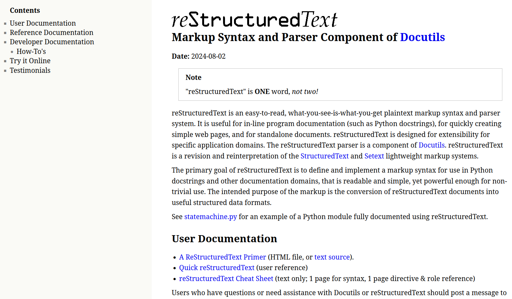
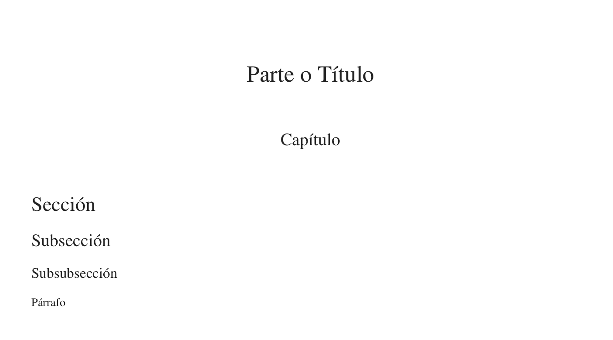
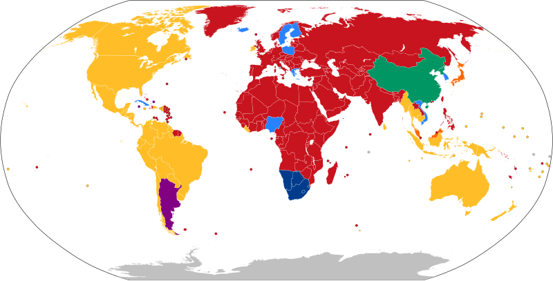
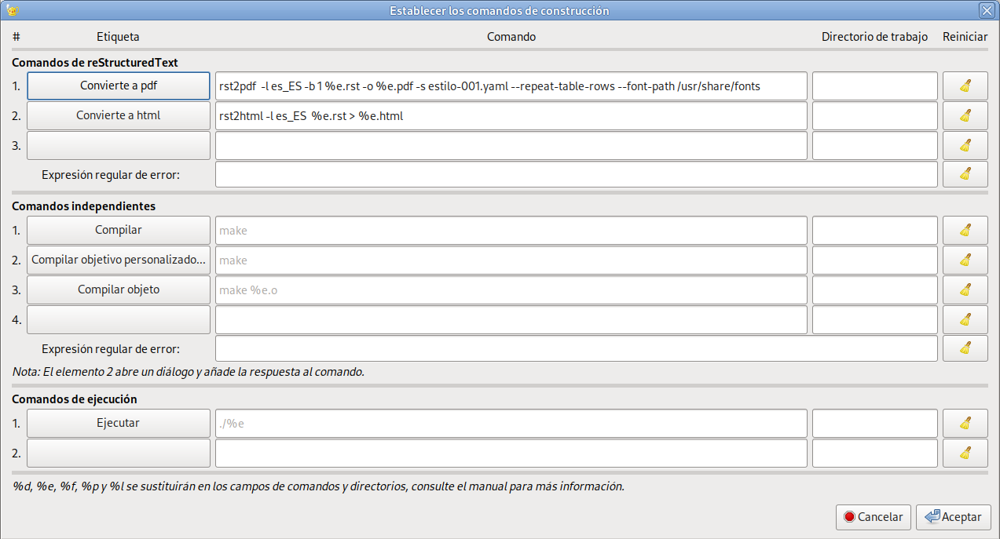
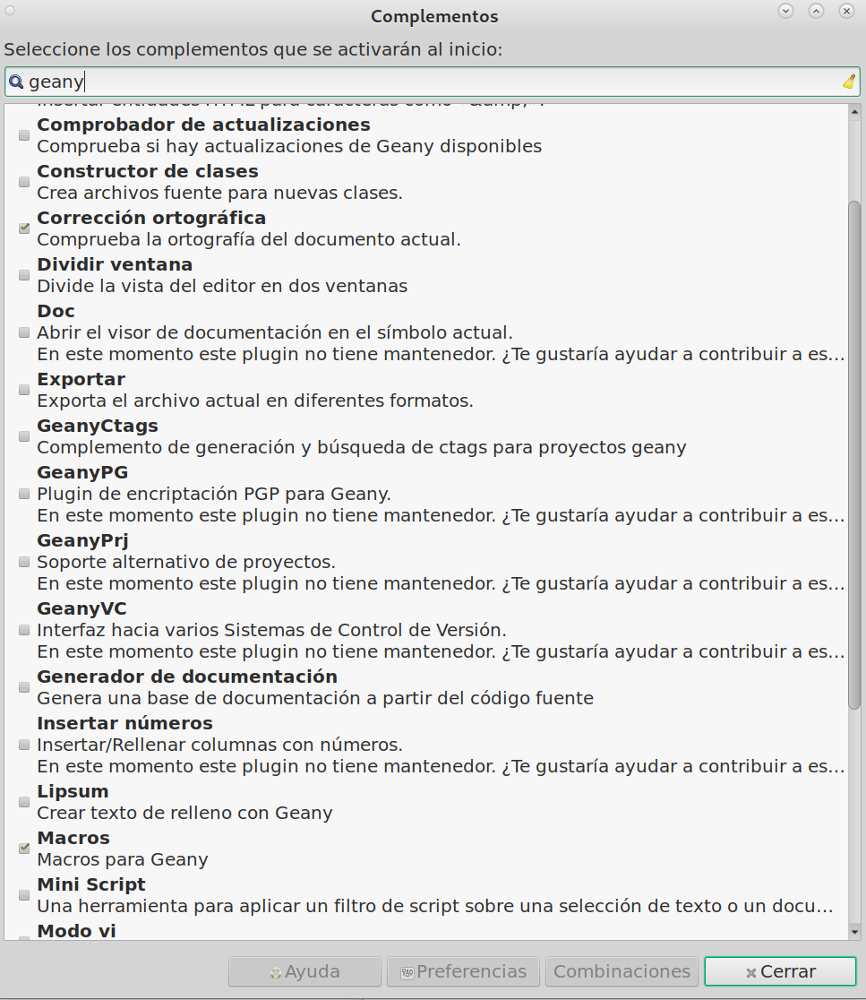

.. Borrar la siguiente línea en la siguiente revisión
.. .. default-role:: math 

   
##################################################
Comandos básicos para *re*\ ``Structured``\ *Text*
##################################################

:Autor: Angel de la Iglesia Gonzalo
:Versión/rev: 0/1
:Fecha:  20250407
:Copyright: Este trabajo está bajo licencia *Creative Commons BY-NC-SA 4.0* (https://creativecommons.org/licenses/by-nc-sa/4.0/deed.es) que te permite compartir, adaptar y redistribuir esta obra, siempre y cuando des crédito de manera adecuada a la obra original, no hagas uso con propósito comercial de la obra y si compartes tu nueva obra, lo hagas bajo esta misma licencia.
:Asbstract: This document is an introduction and a short tutorial on *re*\ ``Structured``\ *Text* for obtaining complete documents in *pdf* or *html* and can serve as an introduction to writing documents with *Sphinx*. This document is not about *Sphinx*. **Resumen**: Este documento es una introducción y un pequeño tutorial sobre    *re*\ ``Structured``\ *Text* para la obtención de documentos completos en *pdf* o *html* y puede servir como una introducción a la escritura de documentos con *Sphinx*. Este documento no trata de *Sphinx*.

.. sectnum::
.. header:: ###Title### - Sección: ###Section###
.. footer:: ###Page###

.. meta::
    :keywords: pdf, html, conversores, tutorial, introducción
    :description lang=es: Una introducción o tutorial a ReST

|
|
|

.. _`un ejemplo de este comportamiento`:


   
   **Captura de la imágen de reStruredText en la página oficial de** Docutils_.

.. raw:: pdf

   PageBreak paginaIndice
   SetPageCounter 1 lowerroman
    
.. contents:: Índice
   :backlinks: top

.. raw:: pdf

    PageBreak Normal
    SetPageCounter 1
    


************
Introducción
************

*re*\ ``Structured``\ *Text* es un lenguaje de marcado que permite escribir textos con formato (parecido al resultado que se obtiene con un procesador de texto) pero en el que nosotros escribimos los comandos de formateo en el mismo texto. Cualquier editor de texto plano sirve para convertir documentos medianamente complejos a formatos *html*, *Latex*, *pdf*, *odt* y otros.

Normalmente se utiliza *re*\ ``Structured``\ *Text* como paso previo para escribir documentos mediante Sphinx_ que es un sistema de documentación muy flexible y utilizado por muchas personas en el mundo relacionados con python_ pero tambien por otros muchos que no se relacionan con *python* directamente. Muchas organizaciones aceptan documentación en este formato para múltiples fines (https://about.readthedocs.com/pricing/#/community, https://docs.readthedocs.com/platform/stable/).

*re*\ ``Structured``\ *Text* pertenece a los llamados `lenguajes de marcado  <https://es.wikipedia.org/wiki/Lenguaje_de_marcado>`_ que son sistemas de codificación de texto que especifica la estructura y el formato de un documento y las relaciones entre sus partes (índices o pies de página, por ejemplo) y son capaces de insertar referencias externas al documento, ya sea en el propio ordenador o en *Internet*. *re*\ ``Structured``\ *Text* tiene una `curva de aprendizaje <https://es.wikipedia.org/wiki/Curva_de_aprendizaje>`_ no muy complicada y permite generar documentos bien formateados, incluso sin recurrir a otras herramienta, como *sphinx*, que permiten ampliarlo. Este documento pretende enseñarte a usar *re*\ ``Structured``\ *Text* para generar documentos completos en *html* y *pdf* mediante los programas *rst2html* y *rst2pdf*.

.. sidebar:: 

    Yo trabajo en *Linux* con una distribución Debian_, si no es tu caso deberás buscar los paquetes equivalentes de tu distribución.

Para instalar los programas necesarios para seguir los ejemplos de este documento deberás instalar los siguientes paquetes (seguramente algunos de ellos ya estarán en tu sistema) :

.. code:: bash

    $ sudo apt install docutils-common docutils-doc python3-docutils \
    python3-pybtex-docutils python3-recommonmark python3-pyphen \
    python3-pygments hyphen-es rst2pdf 


Muchas veces hago referencia al *fichero fuente* de este documento como ejemplo de lo que quiero obtener, pero generalmente el ejemplo se incluye en el propio texto y no será necesario tener abierto el fichero fuente para seguir las explicaciones (aunque es recomendable). Sobre todo al principio no te abrumes con los símbolos de marcado que todavía no conoces y ve avanzando haciendo los mismos ejemplos o similares de la forma que te propongo en el documento. También te recomiendo que en una primera lectura no abras los enlaces a medida que vas leyendo sino que lo hagas en una segunda o tercera lectura. Siempre los podrás abrir para resolver dudas o aumentar tu conocimiento sobre el tema. Te recomiendo, también, que veas el documento en *html* y en *pdf* porque algunas veces el resultado no es igual e incluso puede que en un formato la impresión sea correcta y en el otro formato produzca un error.

Como siempre la mejor documentación es la original. En este caso puedes encontrar la Documentación de docutils en  https://docutils.sourceforge.io/docs/index.html y para `rst2pdf <https://rst2pdf.org/>`_ el manual está en https://rst2pdf.org/static/manual.html, en *html* y en https://rst2pdf.org/static/manual.pdf, en *pdf*. Este documento pretende enseñarte a usar estos programas de una forma un poco más amigable que la documentación oficial. Intenta ser un tutorial de *re*\ ``Structured``\ *Text*, de poco más de 100 páginas en un *pdf*, escrito con estos programas y que puedes ver el resultado en *html* o *pdf* así como el fichero *fuente* a partir del que se generan.

.. warning::

    No soy un experto en *re*\ ``Structured``\ *Text*, simplemente he aprendido un poco a como usarlo y este documento es un resumen que intento que sea útil.

.. note:: Si estás viendo este documento en *html* verás que al principio de la página aparece ``###Title### - Sección: ###Section###`` e igualmente al final de todo el documento verás ``###Page###``. Esto se explica en el apartado `Cabeceras y Pies de página`_.

**************
Primeros pasos
**************


Títulos y secciones
===================

Cuando escribimos un documento lo primero que solemos hacer es poner el título y crear secciones para organizar el texto [#]_ (Nota: Si cliqueas sobre el número que aparece en azul irás a la *nota* asociada y volviendo a cliquear en el mismo número que está a la izquierda de la *nota* volverás aquí).

.. [#]  En español también se suele utilizar *apartado* o *párrafo* como sinónimos de *sección*. Verás que la presentación de la *nota* en *html*, si has utilizado ``rst2html``,  es justo a continuación del párrafo que la contiene y será una *nota al final del documento* si has convertido con ``rst2pdf``.

Para la creación de títulos, capítulos y secciones se pueden utilizar cualquiera de los siguientes caracteres como caracteres de subrayado de los títulos::

    = - ` : ' " ~ ^ _ * + # < >

En general, basta subrayar el texto del título o sección con cualquiera de los caracteres anteriores hasta, al menos, la longitud del texto para establecer título. El nivel del título no tiene que ver con el orden en que he presentado anteriormente cada uno de los caracteres. Puedes elegir cualquiera. El convertidor [#]_ siempre ordena según el orden en el que hayas creado cada nivel automáticamente. Es decir, si eliges ``#`` como primer nivel (el primero que escribes) los caracteres ``##...#`` siempre serán un título de nivel "1". De la misma forma si eliges ``*`` como símbolo para el segundo nivel, cada vez que escribas ``**...*`` se corresponderá con un nivel "2" y así sucesivamente. 

.. [#]  El convertidor es el programa que convierte el fichero *fuente* al formato deseado *html*, *pdf* u otros (*rst2html* o *rst2pdf* o los otros disponibles en tu sistema).

Los dos primeros niveles se pueden subrayar por abajo y por encima para remarcar los niveles. 

Es conveniente que elijas un criterio para ordenar los niveles y te mantengas en él. Como referencia útil, el `manual de sphinx`_ recomienda lo siguiente:

.. _`manual de sphinx`: https://www.sphinx-doc.org/en/master/usage/restructuredtext/basics.html#sections

.. _`ejemplo-001.rst`:

**Código de ejemplo-001.rst**

.. code:: rst

    ##############
    Parte o Título
    ##############

    ********
    Capítulo
    ********

    Sección
    =======

    Subsección
    ----------

    Subsubsección
    ^^^^^^^^^^^^^

    Párrafo
    """""""

Que cuando lo convirtamos y lo abramos con un visor *html* o *pdf* se verá algo parecido a:


   
   **Código de ejemplo-001.rst convertido**

Cómo convertir el fichero fuente
================================

Puedes crear un fichero con el contenido del código de `ejemplo-001.rst`_ y salvarlo con un nombre como **ejemplo-001.rst**. Lo puedes convertir con cualquiera de los comandos:

.. code:: bash

    rst2html            rst2odt_prepstyles  
    rst2html4           rst2pdf             
    rst2html5           rst2pseudoxml       rst-buildhtml
    rst2latex           rst2s5              rstpep2html
    rst2man             rst2xetex           
    rst2odt             rst2xml

Para ver lo que hacen (la mayoría son auto explicativos) puedes teclear ``man comando``, así, además, podrás ver las opciones de cada comando. Posteriormente veremos las opciones más interesantes en el apartado `Comandos para la conversión de documentos con rst2xxx`_


Por ejemplo para crear una página *web* tecleamos:

.. code:: bash

    $ rst2html ejemplo-001.rst ejemplo-001.html  


También se puede hacer:

.. code:: bash

    $ rst2html ejemplo-001.rst > ejemplo-001.html   

**NOTA**: prueba a utilizar ``rst2html4`` y ``rst2html5`` que funcionarán con este documento.

Y para crear un *pdf* hacemos:

.. code:: bash

   $ rst2pdf ejemplo-001.rst -o ejemplo-001.pdf 
    
o

.. code:: bash

    $ rst2pdf ejemplo-001.rst > ejemplo-001.pdf 

**Nota**: Fíjate que la manera de nombrar al fichero de salida varía según el comando que utilices. Solamente la redirección ``>`` funciona en los dos casos. Si no pones los argumentos para generar el fichero de salida verás que el comando de conversión imprime en la consola el texto del fichero convertido. 

Además si quieres que algunas palabras reservadas que usan los conversores ``res2xx`` aparezcan en español (*aviso* en lugar de *warning*, *consejo* en lugar de *hint*, etc. tal como aparecen en el apartado `Exhortaciones (Admonitions)`_) deberás utilizar, además, la opción ``-l es_ES``.

.. code:: bash

    $ rst2html -l es_ES ejemplo-001.rst ejemplo-001.html  

y

.. code:: bash

   $ rst2pdf -l es_ES ejemplo-001.rst -o ejemplo-001.pdf 

.. note::
    Como veremos posteriormente, en mi sistema, funciona tanto utilizar ``es_ES`` como ``es`` para la *localización* del texto.


.. warning::
    Si haces conversiones a *pdf* con ``rst2pdf`` es muy posible que ni el tipo de letra, ni el tamaño de letra, ni la separación silábica de los párrafos o el sangrado en las listas que tu obtienes sea como el que ves en mi *pdf*. Esto es debido al uso de Estilos_ que veremos posteriormente. No obstante y sin aplicar *estilos* verás que el *pdf* generado es muy correcto.


Párrafos
========

Un párrafo en *reStructuredText* (a partir de ahora lo identificaremos como `ReST <https://docutils.sourceforge.io/0.6/FAQ.html#what-s-the-standard-abbreviation-for-restructuredtext>`_) es un texto que está separado de otro, al menos, por una línea en blanco. Así:

.. code:: rst

    Esto es un texto      escrito        en
    tres líneas que
    solo es un párrafo.
    
    
    
    
    Y esto es otro párrafo que se escribe a continuación del anterior.
    
             Y este es un párrafo con sangría (*indent* en inglés).
         
    Y este párrafo vuelve a la columna 1. 

Al convertir el fichero fuente que contiene este texto se ve como:

|

Esto es un texto escrito en
tres líneas que
solo es un párrafo.


Y esto es otro párrafo que se escribe a continuación del anterior.

     Y este es un párrafo con sangría (*indent* en inglés).
     
Y este párrafo vuelve a la columna 1.

|

Fíjate en que los espacios en blanco entre algunas palabras de la primera línea son ignorados y las cuatro líneas en blanco que hay entre los dos párrafos, al convertir el fichero fuente, solo produce una línea en blanco.

Si quieres expresamente líneas en blanco para separar párrafos hay que poner el carácter ``|`` en la primera columna y dejar una línea en blanco antes y después del carácter de la barra vertical. El ejemplo anterior se escribe así:

.. code:: rst

    Esto es un texto      escrito        en
    tres líneas que
    solo es un párrafo.
    
    |
    |
    |
    |
    
    Y esto es otro párrafo que se escribe a continuación del anterior
    pero con cuatro líneas en blanco antes.
    
             Y este es un párrafo con sangría (*indent* en inglés).
         
    Y este párrafo vuelve a la columna 1.
    
que al convertirlo se verá como:

|

Esto es un texto      escrito        en
tres líneas que
solo es un párrafo.

|
|
|
|

Y esto es otro párrafo que se escribe a continuación del anterior pero
con cuatro líneas en blanco antes.

     Y este es un párrafo con sangría (*indent* en inglés).
     
Y este párrafo vuelve a la columna 1.

Para forzar espacios en blanco es un poco más complicado. Hay que identificar un espacio forzado de unicode y escribir el `alias <https://es.wikipedia.org/wiki/Alias_(Unix)>`_ dejando un espacio en blanco delante y detrás:

.. code:: rst

    .. |c_b|   unicode:: U+00A0 .. Espacio forzado
    
    Esto es un texto |c_b|  |c_b|  |c_b|  |c_b|  |c_b|  |c_b| escrito        en
    tres líneas que
    solo es un párrafo.
    
Que al convertirlo se verá como:

|

.. |c_b|   unicode:: U+00A0 .. Espacio forzado

Esto es un texto |c_b|  |c_b|  |c_b|  |c_b|  |c_b|  |c_b| escrito        en
tres líneas que
solo es un párrafo.

|

La instrucción que aparece como:

.. code:: rst

    .. |c_b|   unicode:: U+00A0 .. Espacio forzado


solo hay que escribirla una vez en el fichero fuente, no importa antes o después de las sustituciones.  ``c_b`` es una etiqueta que me he inventado y que funciona como un *alias* del carácter en blanco cuando está entre las barras verticales para crear un procedimiento de sustitución ``|c_b|``.

Como resumen: un *párrafo* es una agrupación de texto que esta separado 
de otro párrafo por al menos una línea en blanco. Si hay más de una 
línea en blanco el convertidor ignora todas menos una. Los *párrafos* 
deben tener la misma sangría. Si no la tienen el *párrafo* sangrado 
aparecerá también sangrado en la salida. Los espacios en *blanco* entre las palabras de un *párrafo* son reducidos a un único *blanco*. Todas las líneas del mismo párrafo deben estar alineadas a la izquierda con el mismo nivel de sangría. Puede haber varios niveles de sangría en un documento.

|

.. Note::

    En español el término indentar_ (*indent* en inglés) no está reconocido por el `diccionario de la RAE`_.  
    Debe traducirse por sangrar, sangría o sangrado. Pero en el 
    mundo de los ordenadores se usa muy frecuentemente aunque, por ahora, es un palabro_.
    
.. _indentar: https://es.wikipedia.org/wiki/Estilo_de_sangrado 

.. _`diccionario de la RAE`: https://dle.rae.es/indentar?m=form 

.. _palabro: https://dle.rae.es/palabro?m=form


Comentarios
-----------

El texto:

.. code:: rst

    .. Espacio forzado

que aparece al final de la línea es un comentario. También podría ir en la primera columna. Si los dos puntos aparecen en la primera y segunda columnas, todo lo que venga a continuación será un comentario hasta el siguiente párrafo. Si el siguiente párrafo está sangrado (al menos la primera columna es un espacio en blanco) el convertidor ignorará el texto y seguirá siendo un comentario.

.. code:: rst

    .. esto es un comentario
     y sigue aquí.
     
    Que como (no) ves no aparece en el texto convertido.
     
.. esto es un comentario
 y sigue aquí.
 
Que como (no) ves no aparece en el texto convertido pero está en el fichero fuente.

Si sabes algo de *ReST* quizás te extrañará que un comentario empiece por "``..`` |c_b|" (dos puntos y, al menos, un espacio en blanco) como empiezan algunos códigos de marcado de *ReST*. ¿Cómo sabe *ReST* que es un comentario? Pues precisamente porque lo que sigue al espacio en blanco no coincide con ningún código utilizado por *ReST*.

Formateo de texto
=================

Al escribir cualquier documento es usual que queramos utilizar **negrita** o *cursiva* y, a veces, nos interesa escribir ``algún texto en un tipo de letra mono espaciado``. La negrita se consigue encerrando el texto entre una pareja de asteriscos, la cursiva se obtiene encerrando la frase entre asteriscos (uno a cada lado), para letra mono espaciada la frase se encierra entre `dobles acentos graves <https://es.wikipedia.org/wiki/Acento_grave>`_ `` (ojo **no** son las dobles comillas que se obtienen, en el teclado español, con ``Mayúsculas + 2``, son las comillas hacia atrás que hay que pulsar dos veces para que aparezcan una vez en la pantalla) tanto al comienzo como al final del texto.

El código fuente del párrafo anterior es::

    Al escribir cualquier documento es usual que queramos utilizar 
    **negrita** o *cursiva* y, a veces, nos interesa escribir ``algún 
    texto en un tipo de letra mono espaciado``. La negrita se consigue 
    encerrando el texto entre una pareja de asteriscos, la cursiva se 
    obtiene encerrando la frase entre asteriscos (uno a cada lado), 
    para letra mono espaciada la frase se encierra entre `dobles 
    acentos graves <https://es.wikipedia.org/wiki/Acento_grave>`_ `` 
    (ojo **no** son las dobles comillas que se obtienen, en el teclado 
    español, con ``Mayúsculas + 2``, son las comillas hacia atrás 
    que hay que pulsar dos veces para que aparezcan una vez en
    la pantalla) tanto al comienzo como al final del texto.


.. _`carácter de escape`:

Si lo que quieres es escribir \*un texto entre asteriscos\* tienes que utilizar la barra hacia atrás \\ [#]_ como carácter de escape, tal como se ve en el fichero fuente de este párrafo.

.. code:: rst

    Si lo que quieres es escribir \*un texto entre asteriscos\* tienes 
    que utilizar la barra hacia atrás \\ [#]_ como carácter de escape, tal 
    como se ve en el fichero fuente de este párrafo.

.. [#]  También hay que *escapar* la barra hacia atrás para que se imprima.

Otra forma de formatear texto es para la representación literal de texto (en inglés muchas veces se utiliza el término *verbatim*). Por ejemplo, para representar código fuente. El siguiente ejemplo muestra un programa escrito en rust_.

.. _rust: https://www.rust-lang.org/es

::

    fn main() {
        println!("Hola ¿Cómo estás?");
    }

Para imprimir lo anterior el fichero fuente contiene::

    ::
    
        fn main() {
            println!("Hola ¿Cómo estás?");
        }

Los dos puntos repetidos ``::`` en la primera columna indica que todo lo que venga a continuación y esté sangrado sera representado literalmente hasta justo antes del primer texto que aparezca en la primera columna.

Para simplificar un poco la escritura cuando en el texto se utiliza naturalmente los dos puntos en una frase que continúa en el párrafo siguiente se puede escribir los ``::`` al final de la frase como en el siguiente ejemplo::

    En un lugar de la mancha de cuyo nombre ...
    
que en el fichero fuente puedes ver como::

    ... siguiente se puede escribir los ``::`` al final de la frase como
    en el siguiente ejemplo::
    
        En un lugar de la mancha de cuyo nombre ...

.. _`embellecimiento de código`:

Para el código fuente de muchos lenguajes de programación *ReST* dispone de una forma que embellece la presentación del código resaltando la sintaxis. El ejemplo de *rust* que vimos anteriormente se ve como:

.. code:: rust

        fn main() {
            println!("Hola ¿Cómo estás?");
        }
        
En el fichero fuente puedes ver que para obtener lo anterior se escribe::

    .. code:: rust
    
            fn main() {
                println!("Hola ¿Cómo estás?");
            }
 
En lugar de *rust* puedes poner el nombre del lenguaje que tú utilices. La lista de lenguajes soportados la puedes ver en: https://pygments.org/languages/.


Con la representación literal de texto hay que tener cuidado porque, literalmente, hace lo que dice que hace. Si escribes una línea de texto muy larga, que tiene por ejemplo 43 palabras (tal como esta) y lo conviertes obtendrás algo como esto [#]_::

    Con la representación literal de texto hay que tener cuidado porque, literalmente, hace lo que dice que hace. Si escribes una línea de texto muy larga, que tiene por ejemplo 43 palabras (tal como esta) y lo conviertes obtendrás algo como esto::

.. [#] Realmente depende de la opción ``--fit-literal-mode=MODE`` que utilices al convertir el fichero con ``rst2pdf``. Lo puedes ver en el apartado `Comando para convertir a pdf mediante rst2pdf`_ . En *html* lo verás como una línea que prosigue a la derecha de la pantalla y que podrás ver desplazándote hacia la derecha.

Literalmente ha escrito una línea y lo ha ajustado a una línea de texto en el fichero de salida. Para que no ocurra eso deberás partir la línea en tantas líneas como sean necesarias para que la lectura sea cómoda. Por ejemplo, representando los retornos de carro::

    Con la representación literal de texto hay que tener cuidado↵ 
    porque, literalmente, hace lo que dice que hace. Si escribes una↵ 
    línea de texto muy larga, que tiene por ejemplo 43 palabras (tal↵ 
    como esta) y lo conviertes obtendrás algo como esto::↵

Algunos editores tienen comandos específicos para hacer esto. Por ejemplo en neovim_ el comando ''gq'' seguido de la tecla ``↓`` y en *Geany* el comando es ``CTRL j`` que aparece en ``Editar → Formato → Reestructurar líneas/bloque`` dividen la línea larga al tamaño de línea que tengan definido. En cualquier caso, asegúrate de que las líneas comienzan en la misma columna para que no aparezcan sangradas. 

Consideraciones al formateo de texto
------------------------------------

Si aparecen asteriscos o comillas graves en el texto, el conversor se puede confundir con esos delimitadores de marcado en línea. Para representar estos caracteres de marcado como texto normal estos deben escaparse_ con una barra invertida, tal como hemos visto anteriormente (`carácter de escape`_).

.. _escaparse: https://es.wikipedia.org/wiki/Caracteres_de_escape

Ten en cuenta algunas restricciones de este tipo marcado:

- No puede estar anidado,

- El contenido no puede comenzar o terminar con un espacio en blanco: ``* hola*`` imprime * hola*, no *hola*.

- Los asteriscos o comillas graves deben estar separado del texto por caracteres que no sean palabras (*blancos*). Se puede usar un carácter de escape con barra invertida para comerte el espacio de separación: ``Esta\ *es*\ *una*\ palabra`` produce: Esta\ *es*\ *una*\ palabra, mientras que ``Esta*es**una*palabra`` produce: Esta*es**una*palabra.


Listas
======

*ReST* dispone de varios tipos de listas que son versátiles y muy fáciles de crear.

Lista ordenadas
---------------

Las *listas ordenadas* pueden ordenarse con números (no tienen límite, puedes hacer la lista tan grande como quieras (si tienes suficiente tiempo ...). Pueden ordenarse con letras mayúsculas o minúsculas (puedes escribir hasta la Z/z). También puedes crear una lista con números romanos en mayúsculas o minúsculas hasta el número 4999 (MMMMCMXCIX o mmmmcmxcix. No sé el por qué de este límite).

Cada carácter que identifica el orden puede seguirse con un punto a continuación, entre paréntesis o con solo el paréntesis de cierre. Hay que dejar al menos un espacio en blanco antes de escribir el texto de la lista.

.. note::
    El convertidor puede hacer que la salida para imprimir no sea la que esperas.

A continuación te presento varios ejemplos:

1. Primer elemento de la lista
2. Segundo elemento de la lista
3. Tercer elemento de la lista

que se genera con:

.. code:: rst

    1. Primer elemento de la lista
    2. Segundo elemento de la lista
    3. Tercer elemento de la lista

|

Con letras mayúsculas
  
A. Primer elemento de la lista
B. Segundo elemento de la lista
C. Tercer elemento de la lista


que se genera con:

.. code:: rst

    A. Primer elemento de la lista
    B. Segundo elemento de la lista
    C. Tercer elemento de la lista

|

Con letras minúsculas
  
(a) Primer elemento de la lista
(b) Segundo elemento de la lista
(c) Tercer elemento de la lista


que se genera con:

.. code:: rst

    (a) Primer elemento de la lista
    (b) Segundo elemento de la lista
    (c) Tercer elemento de la lista

.. note::
    En mi caso, al convertir a *pdf* o *html* la lista aparece como:
    
         a. en lugar de (a)
    
         b. en lugar de (b)
    
         c. en lugar de (c)


|

Con letras números romanos
  
i.    Primer elemento de la lista
ii.   Segundo elemento de la lista
iii.  Tercer elemento de la lista

que se genera con:

.. code:: rst

    i.    Primer elemento de la lista
    ii.   Segundo elemento de la lista
    iii.  Tercer elemento de la lista

|

.. note::
    Con mi sistema, en la conversión a *pdf* no hace bien la tabulación después del número romano, en *html* sí lo hace bien. Si lo ves bien en *pdf* es porque he aplicado un *estilo* que recojo en el apartado Estilos_.

Se pueden anidar distintos tipos de listas y empezar por valores 
arbitrarios (pero luego hay que seguir ordenadamente) y es obligatorio 
que la lista anidada esté separada de la lista *padre* por líneas en 
blanco:

|

Con letras mayúsculas y números
  
A. Primer elemento de la lista

    5) sub primer elemento
    6) sub segundo elemento

B. Segundo elemento de la lista

    n. sub primer elemento
    o. sub segundo elemento

C. Tercer elemento de la lista

|

que se genera con:

.. code:: rst

    Con letras mayúsculas y números
      
    A. Primer elemento de la lista
    
        5) sub primer elemento
        6) sub segundo elemento
    
    B. Segundo elemento de la lista
    
        n. sub primer elemento
        o. sub segundo elemento
    
    C. Tercer elemento de la lista

**Nota**: La *Ñ* o *ñ* no sirven para ordenar una lista.

|

También es importante saber que se pueden generar listas con numeración automática:
  
#. Primer elemento de la lista
#. Segundo elemento de la lista
#. Tercer elemento de la lista

que se genera con:

.. code:: rst

    #. Primer elemento de la lista
    #. Segundo elemento de la lista
    #. Tercer elemento de la lista

La documentación de *ReST* dice que *se recomienda que el carácter enumerador del primer elemento de la lista sea el primer representante de la lista ("1", "A", "a", "I" o "i"). Aunque se reconocerán otros valores iniciales, es posible que el formato de salida (html, pdf, odt, latex ...) no los admita*.

Se pueden hacer listas sangradas. El sangrado se puede hacer con un carácter en blanco o más. Hay que tener cuidado con el sangrado porque si, por ejemplo, el primer elemento de una lista está sangrado con dos espacios en blanco y en el segundo elemento pones tres espacios en blanco se creará, e inicializará, una lista nueva. Si vuelves al sangrado anterior será una nueva lista y se reiniciará también, como en el ejemplo siguiente:

  #. Primer elemento.
  
   #. Segundo elemento.
   
  #. Tercer elemento.
  #. Cuarto elemento.

Que se ha generado con:

.. code:: rst

      #. Primer elemento.
      
       #. Segundo elemento.
       
      #. Tercer elemento.
      #. Cuarto elemento.

Si hubiéramos puesto todo con el mismo nivel de sangrado (dos espacios en blanco) obtendríamos:

  #. Primer elemento.
  
  #. Segundo elemento.
  
  #. Tercer elemento.
  #. Cuarto elemento.

Listas con viñetas (o listas no ordenadas)
------------------------------------------

Una lista de viñetas, o lista no ordenada, puede empezar con cualquiera de los siguientes caracteres, ``*``, ``+`` o ``-``,  seguido de un carácter en blanco. Por ejemplo:

* Esta es la primera línea con viñeta. Es obligatorio dejar una línea en blanco antes de la viñeta, pero no necesario (aunque recomendable por legibilidad del fichero fuente) dejar una línea en blanco antes de la siguiente viñeta.
* Esta es la segunda viñeta.
* Esta es la tercera viñeta.

    - Esta es una viñeta con sangría (necesita que dejes una línea en blanco antes de esta en el fichero fuente).
    - Esta es la segunda viñeta con sangría.
           
+ Puedes utilizar cualquiera de los caracteres ``*``, ``+`` o ``-`` para  las viñetas y el conversor generará una viñeta con uno de los caracteres que tiene  disponibles, no necesariamente el que tú has utilizado.
    
Y esto vuelve a ser texto normal.

En el fichero fuente el texto anterior se escribe como:

.. code:: rst
    
    
    * Esta es la primera línea con viñeta. Es obligatorio dejar una(no↵)
    línea en blanco antes de la viñeta, pero no necesario(no↵) 
    (aunque recomendable por legibilidad del fichero fuente)(no↵)
    dejar una línea en blanco antes de la siguiente viñeta.↵
    * Esta es la segunda viñeta.↵
    * Esta es la tercera viñeta.↵
    
        - Esta es una viñeta con sangría (necesita que dejes una(no↵)
        línea en blanco antes de esta en el fichero fuente).↵
        - Esta es la segunda viñeta con sangría.↵
               
    + Puedes utilizar cualquiera de los caracteres ``*``, ``+`` o(no↵)
    ``-`` para  las viñetas y el conversor generará una viñeta(no↵)
    con uno de los caracteres que tiene  disponibles, no(no↵)
    necesariamente el que tú has utilizado.↵
        
    Y esto vuelve a ser texto normal.↵    

.. note:: En el ejemplo anterior he forzado los retornos de carro (↵) para la presentación literal en el fichero fuente, pero las líneas con viñetas no se pueden partir con retornos de carro (no↵).
    

Listas de definición (o de diccionario)
---------------------------------------

Estas son listas en las que una palabra o grupo de palabras se define en el texto siguiente. 

Para construir la lista se escribe(n) la(s) palabra(s) a definir y en la 
línea siguiente con, al menos, un carácter en blanco al principio de la 
línea se escribe la definición. La definición solo puede tener 
una línea de texto.

Definición:
 La segunda acepción de la *RAE* dice que es una "*Proposición que expone con claridad y exactitud los caracteres genéricos y diferenciales de algo material o inmaterial*".
 
Convertidor a *pdf* en *ReST*:
 Para convertir el fichero fuente ``ejemplo-006.rst`` a *pdf* el comando a utilizar es ``rst2pdf ejemplo-006.rst -o ejemplo-006.pdf``.
 
.. Nota: el fichero  ejemplo-006.rst no existe.
 
Que se obtiene del siguiente texto en el fichero fuente:

.. code:: rst

    Definición:
     La segunda acepción de la *RAE* dice que es una "*Proposición que
     expone con claridad y exactitud los caracteres genéricos y
     diferenciales de algo material o inmaterial*".
     
    Convertidor a *pdf* en *ReST*:
     Para convertir el fichero fuente ``ejemplo-006.rst`` a *pdf* el
     comando a utilizar es ``rst2pdf ejemplo-006.rst -o ejemplo-006.pdf``.

Lista de campos
---------------

Estas listas representan información que se estructura en campos para presentar la información. Cada campo queda encerrado entre ``:`` delante y detrás. La información relativa a ese campo se escribe a continuación con un espacio en blanco antes de comenzar el texto. Por ejemplo:
 
:Fecha: 2024 09 10
:Versión: 1
:Autor: Juan Bravo Valiente

que se genera con:

.. code:: rst
     
    :Fecha: 2024 09 10
    :Versión: 1
    :Autor: Juan Bravo Valiente

Lista de opciones
-----------------

Estas lista están pensadas para listar las opciones de un comando:

* Cortas de *POSIX*. Consisten en un guión y una letra que representa una opción y una descripción separada por , al menos, un tabulador en blanco.

* Largas  de *POSIX*. Consisten en dos guiones y una palabra descriptiva  y una descripción separada por , al menos, un tabulador en blanco.

* Para *DOS/VMS*. Consiste en una barra inclinada, espacio y una letra o palabra y una descripción separada por , al menos, un tabulador en blanco.

Por ejemplo, para el comando *hace_algo*:

:hace_algo:

-a            Opción "a"
-b file       Las opciones pueden tener argumentos
              y descripciones largas
--long        Admite la opción larga.
--input=file  Las opciones largas 
              pueden tener argumentos
/V            Estilo DOS/VMS 

que se genera con:

.. code:: rst

    :hace_algo:
    
    -a            Opción "a"
    -b file       Las opciones pueden tener argumentos
                  y descripciones largas
    --long        Admite la opción larga.
    --input=file  Las opciones largas 
                  pueden tener argumentos
    /V            Estilo DOS/VMS 


Bloques de texto sin formatear
==============================

Como hemos visto *ReST* une las líneas que separamos mediante un retorno de carro (``↵``) siempre que formen lo que el programa entiende por un párrafo. Esto algunas veces es un inconveniente ya que si queremos escribir líneas cortas, justo una a continuación de la otra como por ejemplo en una dirección:

| Don Miguel de Cervantes
| Calle Doña Dulcinea 7, 3ºD
| Alcalá de Henares

Para conseguir este efecto, el fichero fuente debe tener una barra vertical en la primera columna y un espacio en blanco antes del texto:

.. code:: rst

    | Don Miguel de Cervantes
    | Calle Doña Dulcinea 7, 3ºD
    | Alcalá de Henares

También sirve para escribir versos:

| Al olmo viejo, hendido por el rayo
| y en su mitad podrido,
| con las lluvias de abril y el sol de mayo
| algunas hojas verdes le han salido.
|
|                        Comienzo del poema *A un olmo seco* de Antonio Machado
|

generado con:

.. code:: rst

    | Al olmo viejo, hendido por el rayo
    | y en su mitad podrido,
    | con las lluvias de abril y el sol de mayo
    | algunas hojas verdes le han salido.
    |
    |                        Comienzo del poema *A un olmo seco* de Antonio Machado
    |


También se puede utilizar ``::`` para crear un bloque literal que mantendrá los retornos de carro y los espacios o tabulaciones. 

::

 Al olmo viejo, hendido por el rayo
 y en su mitad podrido,
 con las lluvias de abril y el sol de mayo
 algunas hojas verdes le han salido.

                       Comienzo del poema *A un olmo seco* de Antonio Machado

Fíjate que el texto aparece en un marco con fondo de color si has utilizado *rst2pdf* y un marco transparente si has utilizado *rst2html*.

Para generarlo en el fichero fuente se ha escrito:

.. code:: rst

    ::
    
     Al olmo viejo, hendido por el rayo
     y en su mitad podrido,
     con las lluvias de abril y el sol de mayo
     algunas hojas verdes le han salido.
    
                           Comienzo del poema *A un olmo seco* de Antonio Machado

Realmente esto ya lo vimos en `Formateo de texto`_ pero aplicado a código.


Transiciones
============

Un marcador de transición es un conjunto de 4 o más caracteres de los 
que vimos para `Títulos y secciones`_ y que generan una línea de lado a 
lado del texto. 

Puede generarse con ``----``. Siempre al principio de la línea.

----


Puede generarse con ``++++``. Siempre al principio de la línea.

++++


Puede generarse con ``==========``. Siempre al principio de la línea.

====

que se generan con:

.. code:: rest

    ----
    ++++
    ====


************************
Profundizando en *ReST*
************************

En este capítulo vamos ver unos cuantos comandos más que nos van a permitir escribir documentos útiles.

.. _`referencias internas`:

Referencias internas en el documento
====================================

Las referencias internas del documento se generan con un *guión bajo* justo al final de la palabra que queremos usar como la lanzadera del enlace:

.. code:: rst

   referencia_

En el caso de que la lanzadera comprenda varias palabras, estas se tienen que agrupar mediante acentos graves:

.. code:: rst

   `referencias internas`_


Las referencias son enlaces a una parte del texto que quedan resaltadas y que, poniendo el cursor encima de la referencia, indica a donde va a saltar. El salto se producirá al párrafo siguiente donde pongas la línea:

.. code:: rst

   .. _`referencias internas`:

En este caso he puesto la posición del salto ``.. _`referencias internas``` justo antes de esta sección de forma que cuando pulses sobre `referencias internas`_ vayas al comienzo del apartado.

Referencias implícitas
----------------------

*ReST* dispone de un mecanismo para referenciar *títulos de apartados* y a (que todavía no hemos visto) `Notas a pie de página`_ y `Citas`_. Para referenciar un apartado se pone el título del apartado entre acentos graves seguido del *guión bajo*. por ejemplo para ir al apartado padre de este subapartado el enlace es `Referencias internas en el documento`_ que se ha generado con:

.. code:: rst

   `Referencias internas en el documento`_
   
Y para ir al índice Índice_ la referencia se genera como:

.. code:: rst

   Índice_

Veremos como he generado el Índice en el apartado `Tabla de contenido (Table of contents)`_.

Es útil saber que las referencias las podemos hacer en mayúsculas, minúsculas o mezclas tal como puedes ver aquí: `Referencias implícitas`_, `REFERENCIAS IMPLÍCITAS`_, `REFERENCIAS implícitas`_ o `ReFeReNcIaS iMpLíCiTaS`_ . Todas llevan al mismo apartado. Que se han generado con:

.. code:: rst

    Es útil saber que las referencias las podemos hacer en mayúsculas,
    minúsculas o mezclas tal como puedes ver aquí: `Referencias
    implícitas`_, `REFERENCIAS IMPLÍCITAS`_, `REFERENCIAS implícitas`_ 
    `ReFeReNcIaS iMpLíCiTaS`_ . Todas llevan al mismo apartado. 
    Que se han generado con:

   
.. _externas:
  
Referencias externas al documento
=================================

Las *referencias externas* son enlaces a documentos o páginas *web* que están fuera del documento o que están en internet.

Referencia explícita
--------------------

Una referencia explícita es literalmente la dirección a donde queremos ir, por ejemplo la página de *doc-utils* es https://docutils.sourceforge.io/. Basta pulsar sobre el enlace para ir a la página *web*. También puedes acceder a un documento externo al documento pero que está en tu ordenador, por ejemplo: file:///usr/share/doc/docutils-doc/docs/index.html , abrirá el documento **Docutils Project Documentation Overview** si está instalado en tu ordenador. En el fichero fuente se escribe la dirección literalmente como se escribe en el texto visualizado (incluyendo el *https://* o el *file:///*, en este caso con tres barras inclinadas).

Referencia incrustadas
----------------------

Si no quieres que la dirección aparezca explícitamente en el texto puedes referenciar una dirección con una etiqueta que te dirija a la página deseada. Por ejemplo Docutils_ te llevará a la misma página en el enlace del apartado anterior.

.. _Docutils: https://docutils.sourceforge.io/

Que se genera con:

.. code:: rst

    Por ejemplo Docutils_ te llevará a la misma página en el enlace 
    del apartado anterior.
    
    .. _Docutils: https://docutils.sourceforge.io/

En la que la referencia en el texto se genera poniendo el guión bajo al final de la palabra (o palabras enmarcadas entre acentos graves "`") mientras que en la línea que especifica la dirección la etiqueta comienza con el guión bajo.

Referencias embebidas
^^^^^^^^^^^^^^^^^^^^^

También se puede generar con un enlace embebido. Por ejemplo `wiki de ReStructuredText <https://es.wikipedia.org/wiki/ReStructuredText>`_ se ha generado con:

.. code:: rst

    También se puede generar con un enlace embebido. Por ejemplo `wiki 
    de ReStructuredText <https://es.wikipedia.org/wiki/ReStructuredText>`_
    se ha generado con:

La dirección de la página *web* se tiene que encerrar entre los caracteres de *menor* y *mayor* |c_b| ``< ... >`` y todo el texto y direción entre comillas graves simples "`". 

Referencias anónimas
--------------------
**Nota**: En la documentación oficial de *ReST* se dice que las referencias anónimas: *Son particularmente útiles en documentos breves o documentos de un solo fichero fuente. Sin embargo, es fácil abusar de esta característica y puede causar que el texto fuente sea ilegible y que los documentos no se puedan mantener. Se aconseja usarlas con moderación*. Las podemos considerar como referencias *de un solo uso*.

Para crear `una referencia anónima a un enlace`__ se hace con dos guiones bajos al final de la frase entre acentos graves. La dirección del enlace se puede escribir de dos formas con ``.. __: https://www.dirección.com`` tal como se ve el el fuente de este párrafo:

.. __: https://www.debian.org

.. code:: rst

    Para crear `una referencia anónima a un enlace`__ se hace con dos 
    guiones bajos al final de la frase entre acentos graves. La 
    dirección del enlace se puede escribir de dos formas con ``.. 
    __: https://www.dirección.com`` tal como se ve el el fuente de este 
    párrafo:
    
    .. __: https://www.debian.org

La otra `forma de redireccionar una referencia anónima`__  es empezando la línea con dos guiones bajos, un espacio en blanco y la dirección referenciada. En el fichero fuente de este párrafo se ve:

__ https://www.linux.org 

.. code:: rst

    La otra `forma de redireccionar una referencia anónima`__  es 
    empezando la línea con dos guiones bajos, un espacio en blanco y la 
    dirección referenciada. En el fichero fuente de este párrafo se ve:
    
    __ https://www.linux.org


No podemos llamar otra vez a ```una referencia anónima a un enlace`__`` porque la conversión nos dará un error. 

.. `una referencia anónima a un enlace`__  Si *descomentas* esta línea podrás ver el error

Tampoco podemos referenciar ```forma de redireccionar una referencia anónima`__`` porque las referencias están *caducadas*.

.. `forma de redireccionar una referencia anónima`__  Si *descomentas* esta línea podrás ver el error


Notas a pie de página 
=====================

Las *notas a pie de página* se imprimen dependiendo del conversor utilizado. Si utilizas ``rst2html`` la nota se imprime justo después del párrafo que la contiene, si utilizas ``rst2latex`` al generar el *pdf* la *nota a pie de página* aparece al final de la página donde está la llamada a la nota, por el contrario si utilizas ``rst2pdf`` las *notas al pie de página* aparecen al final del documento. **NOTA**: este es el comportamiento *por defecto* de los conversores, pero puedes modificar el comprotamiento con las opciones de conversión que se ven en el apartado `Comandos para la conversión de documentos con rst2xxx`_, aunque no son muy versátiles (haz pruebas para ver como se comporta).

Las referencias a las notas al pie se pueden generar de cuatro formas diferentes:

1) Con uno o más números: ejemplo caso [1]_, caso [25]_.
2) Auto numeradas: ejemplo caso [#]_, caso [#]_.
3) Etiqueta auto numerada: ejemplo [#etiqueta1]_ [#etiqueta2]_ (**Nota**: La etiqueta no se ve en el texto impreso).
4) Con símbolos generados automáticamente: ejemplo caso Símbolo 1 [*]_, caso Símbolo 2 [*]_, caso Símbolo 3 [*]_.


.. [1] Esta es la nota al caso 1.
.. [25] Esta es la nota al caso 25.
.. [#] Esta es la nota al caso generado automáticamente en primer lugar.
.. [#] Esta es la nota al caso generado automáticamente en segundo lugar.
.. [#etiqueta1] Esta es la nota al caso generado automáticamente con etiqueta en primer lugar.
.. [#etiqueta2] Esta es la nota al caso generado automáticamente con etiqueta en segundo lugar.
.. [*] Esta es la primera etiqueta con símbolos 1 generados automáticamente. 
.. [*] Esta es la segunda etiqueta con símbolos 2 generados automáticamente.
.. [*] Esta es la tercera etiqueta con símbolos 3 generados automáticamente.

|

que se ha generado con:

.. code:: rst

    Las referencias a las notas al pie se pueden generar de cuatro formas
    diferentes:

    1) Con uno o más números: ejemplo caso [1]_, caso [25]_.
    2) Auto numeradas: ejemplo caso [#]_, caso [#]_.
    3) Etiqueta auto numerada: ejemplo [#etiqueta1]_ [#etiqueta2]_ 
    (**Nota**: La etiqueta no se ve en el texto impreso).
    4) Con símbolos generados automáticamente: ejemplo caso Símbolo
    1 [*]_, caso Símbolo 2 [*]_, caso Símbolo 3 [*]_.
    
    
    .. [1] Esta es la nota al caso 1.
    .. [25] Esta es la nota al caso 25.
    .. [#] Esta es la nota al caso generado automáticamente en primer lugar.
    .. [#] Esta es la nota al caso generado automáticamente en segundo lugar.
    .. [#etiqueta1] Esta es la nota al caso generado automáticamente con etiqueta en primer lugar.
    .. [#etiqueta2] Esta es la nota al caso generado automáticamente con etiqueta en segundo lugar.
    .. [*] Esta es la primera etiqueta con símbolos 1 generados automáticamente. 
    .. [*] Esta es la segunda etiqueta con símbolos 2 generados automáticamente.
    .. [*] Esta es la tercera etiqueta con símbolos 3 generados automáticamente.


Fíjate que hemos forzado la nota 1 [1]_ con el número ``[1]_`` y después la nota 25 [25]_ con ``[25]_`` y cuando hemos puesto la numeración automática con ``[#]_`` la numeración comienza con 6 y sigue correlativamente 7, 8 y 9 incluso en la numeración automática con etiqueta (el caso de ``[#etiqueta1]_`` y ``[#etiqueta2]_``). ¿Por qué ha pasado la numeración automática de 1 a 6?.

La razón es que en el primer párrafo del apartado `Títulos y 
secciones`_ había una nota numerada automáticamente y después hay tres notas automáticas *autonumeradas* ([3]_, [4]_ y [5]_) hasta llegar a este apartado. Como aquí hemos forzado empezar con la nota ``[1]_`` el convertidor asigna la 
numeración libre hasta que llegue a la nota ``[25]_``. por lo que la 
secuencia en este párrafo es [1]_, [25]_, [6]_, [7]_, ``[#etiqueta1]_`` 
[#etiqueta1]_ y ``[#etiqueta2]_`` [#etiqueta2]_.

Que se ha generado con:

.. code:: rst

    La razón es que en el primer párrafo del apartado `Títulos y 
    secciones`_ había una nota numerada automáticamente y después hay tres
    notas automáticas *autonumeradas* ([3]_, [4]_ y [5]_) hasta llegar a
    este apartado. Como aquí hemos forzado empezar con la nota ``[1]_`` 
    el convertidor asigna la    numeración libre hasta que llegue a la
    nota ``[25]_``. por lo que la secuencia en este párrafo es [1]_, 
    [25]_, [6]_, [7]_, ``[#etiqueta1]_`` [#etiqueta1]_ y ``[#etiqueta2]_``
    [#etiqueta2]_.

Fíjate que la numeración automática para la nota 3, 4, 5, 6 y 7 se han escrito explícitamente ``[3]_, [4]_, [5]_, [6]_, [7]_``.

Fíjate que cuando vas a la nota [1] aparece a continuación (1, 2, 3) esto es porque la referencia a la nota [1] aparece tres veces en el documento y cada número referencia a la posición donde aparece.

Citas
=====

Las citas (o menciones) son como las notas a pie de página pero con etiquetas que no son numéricas ni con símbolos, son etiquetas alfanuméricas, que no pueden tener espacios en blanco, tales como [REF-001]_ o [llamada-001]_ o [REF-002]_ y [ref-003]_.

.. [REF-001] El texto de esta cita.
.. [llamada-001] El texto de la llamada (que no vuelve).
.. [REF-002] la última llamada.
.. [ref-003] Llamada en minúsculas (que no vuelve).

Que se ha generado con:

.. code::

    Las citas (o menciones) son como las notas a pie de página
    pero con etiquetas que no son numéricas ni con símbolos, son
    etiquetas alfanuméricas, que no pueden tener espacios en
    blanco, tales como [REF-001]_ o [llamada]_ o [REF-002]_ 
    y [ref-003]_.
    
    .. [REF-001] El texto de esta cita.
    .. [llamada-001] El texto de la llamada (que no vuelve).
    .. [REF-002] la última llamada.
    .. [ref-003] Llamada en minúsculas (que no vuelve).

**Nota**: Para que la *cita* pueda volver al origen, si utilizo *rst2pdf* las etiquetas tienen que empezar con mayúsculas. Cuando voy a [llamada-001]_ o [ref-003]_ en el *pdf* no puedo volver, en cambio con [REF-001]_ y [REF-002]_ si puedo volver.

Cabeceras y Pies de página
==========================

Las cabeceras de página son textos que aparecerán en la parte superior de cada página impresa o al principio de la página *web*. Los pies de página son los textos que aparecerán en la parte inferior de cada página impresa o al final de la página *web*.

Las cabeceras y pies se generan con:

.. code:: rst

    .. header::
       Este es el texto de la cabecera. Se pueden utilizar *claves
       mágicas* entre el texto.
       
    .. footer::
       Este es el texto del pie de página.  Se pueden utilizar
       *claves mágicas* entre el texto.  

También se pueden generar como:

.. code:: rst

    .. header:: Este es el texto de la cabecera. Se pueden utilizar
       *claves mágicas* entre el texto.
       
    .. footer:: Este es el texto del pie de página.  Se pueden
       utilizar *claves mágicas* entre el texto.


.. warning::
  Si utilizas las *claves mágicas* (*magic tokens* en inglés) para *rst2pdf* y generas un *html* con *rst2html* lo que se verás en el fichero *html* generado serán las *claves mágicas* (no su contenido) que producen las cabeceras y pies de páginas en el *pdf*; las cabeceras al principio de la página y los pies al final de la página *web*. Si vas a utilizar *html* no utilices las *claves mágicas*.


*Claves mágicas* para cabeceras y pies de página
------------------------------------------------

###Page###
    Sirve para imprimir el número de la página actual.
    
###Title###
    Imprime el título del documento.
    
###Section###
    Imprime el título de la sección de la página actual.
    
###SectNum###
    Imprime el número de la sección de la página actual, siempre que se haya utilizado la directiva ``setnum``.

Por ejemplo las cabeceras y pies de este documento se generan con el siguiente texto:

.. OJO, OJO, OJO hacer coincidir con el documento 

.. code:: rst

    ##################################################
    Comandos básicos para *re*\ ``Structured``\ *Text*
    ##################################################

    :Autor: Angel de la Iglesia Gonzalo
    :Versión/rev: 0/1
    :Fecha:  |fecha|
    :Copyright: Este trabajo está bajo licencia 
    *Creative Commons BY-NC-SA 4.0*
    (https://creativecommons.org/licenses/by-nc-sa/4.0/deed.es)
    que te permite compartir, adaptar y redistribuir esta obra,
    siempre y cuando des crédito de manera adecuada a la obra original,
    no hagas uso con propósito comercial de la obra y si compartes tu
    nueva obra, lo hagas bajo esta misma licencia.
    :Asbstract: This document is an introduction and a short tutorial
    on *re*\ ``Structured``\ *Text* for obtaining complete documents
    in *pdf* or *html* and can serve as an introduction to writing
    documents with *Sphinx*. This document is not about *Sphinx*.
    **Resumen**: Este documento es una introducción y un pequeño
    tutorial sobre    *re*\ ``Structured``\ *Text* para la 
    obtención de documentos completos en *pdf* o *html* y puede
    servir como una introducción a la escritura de documentos
    con *Sphinx*. Este documento no trata de *Sphinx*.
    
    .. sectnum::
    .. header:: ###Title### - Sección: ###Section###
    .. footer:: ###Page###

Como ves también se produce la generación de apartados numerados (``.. sectnum::``).

Referencias en las cabeceras y pies de página
---------------------------------------------

En las cabeceras y pies de página se pueden utilizar referencias como en cualquier otra parte del documento. Por ejemplo si conviertes el siguiente texto con *rst2pdf* y con *rst2html* verás el resultado tanto en un *pdf* o en una página *html*.

.. code:: rst

    .. header::
       Debian__ | linux__ | rst__ | rst2pdf__ 
    
       __ https://www.debian.org/index.es.html
       __ https://www.linux.org/
       __ https://docutils.sourceforge.io/rst.html
       __ https://rst2pdf.org/
       
    Esto es el texto normal.

Aquí hemos visto referencias externas pero podemos utilizar cualquiera de las referencias que hemos visto anteriormente.
 

Tablas
======

Las tablas en *ReST* no son ni muy versátiles ni muy amigables, pero si es posible crear tablas para presentar la información de una forma ordenada.

Tablas sencillas (o simples)
----------------------------

Las tablas sencillas son fáciles de generar. 

Cada columna tiene una serie de símbolos ``=`` que determinan la columna. De columna a columna hay que dejar, al menos, un espacio en blanco (es mejor dejar dos o más espacios en blanco por comodidad de lectura en el fichero fuente). La serie de ``=`` tienen que pertenecer a la primera y a la última línea de la tabla. Se puede hacer una cabecera de la tabla usando una serie de ``-`` debajo del texto de la cabecera y debe cubrir (sin espacios en blanco) la anchura de todas las columnas. A continuación se escribe el título de cada columna, separándolos con espacios en blanco, y se subraya con los símbolos ``=``. Debajo se escriben los valores de cada fila separando cada valor con espacios en blanco y tantas filas como sea necesario. Si, por ejemplo, en la primera columna necesitas que esta aparezca vacía, en el fichero fuente tienes que escribir "\\ " (barra para atrás + espacio en blanco). La *barra para atrás* es un `carácter de escape`_ que vimos en el apartado `Formateo de texto`_. 

Si en el fichero fuente tecleas esto:

.. code:: rst

    ========  =========  ===============
    Tabla de codificación ASCII
    ------------------------------------
      ASCII    Símbolo     Significado
    ========  =========  ===============
       00       NULL      carácter nulo
       01       SOH       inicio encabezado
       \       ...        ...
    ========  =========  ===============   

se imprimirá esto:

========  =========  ===============
Tabla de codificación ASCII
------------------------------------
  ASCII    Símbolo     Significado
========  =========  ===============
   00       NULL      carácter nulo
   01       SOH       inicio encabezado
   \       ...        ...
========  =========  ===============  


Podemos dividir las columnas descontinuando la línea de ``-``, como aquí:

.. code:: rst

    ========  =========  ===============
    Tabla  ASCII
    -------------------  ---------------
      ASCII    Símbolo     Significado
    ========  =========  ===============
       00       NULL      carácter nulo
       01       SOH       inicio encabezado
       \       ...        ...
    ========  =========  =============== 


Para ver:

========  =========  ===============
Tabla  ASCII
-------------------  ---------------
  ASCII    Símbolo     Significado
========  =========  ===============
   00       NULL      carácter nulo
   01       SOH       inicio encabezado
   \       ...        ...
========  =========  =============== 


Otro ejemplo, sacado de la documentación oficial de *ReST* es el siguiente:

.. code:: rst

    =====  =====  ======
       Inputs     Output
    ------------  ------
      A      B    A or B
    =====  =====  ======
    False  False  False
    True   False  True
    False  True   True
    True   True   True
    =====  =====  ======

que imprime:

=====  =====  ======
   Inputs     Output
------------  ------
  A      B    A or B
=====  =====  ======
False  False  False
True   False  True
False  True   True
True   True   True
=====  =====  ======

Te recomiendo que juegues con estas tablas y veas que ocurre si quitas o pones espacios en blanco, ``-`` o ``=``. Verás que la creación de la tabla no es muy amigable. El número de ``-`` o ``=`` debe coincidir en todas las columnas. ¿Y los espacios en blanco? Pruébalo como ejercicio.


Tablas de rejilla (*grid table* en inglés)
------------------------------------------

Las *tablas de rejilla* tal como indica su nombre se construyen representando la tabla mediante una rejilla que contiene el texto. Una fila se signos ``=`` subrayan la cabecera y las esquinas se marcan con ``+``. Las líneas verticales se representan con ``|`` y las horizontales con ``-``. Es posible unir celdas entre columnas o filas *simplemente* quitando los ``|`` o los ``-``. Digo *simplemente* porque cuando lo hagas verás que no es muy amigable. Truco: Para crear la tabla es mejor pulsar la tecla de ``insert``, para poner el teclado en modo *sobreescribir*, para evitar que inserte caracteres y que sobrescriba directamente para crear el texto y los bordes de la tabla. El texto dentro de una celda es tratado como un párrafo normal de *ReST* (los ↵ son ignorados).

+---------------+---------------+--------------+--------------+
|  Cabecera 1   |  Cabecera 2   | Cabecera 3   | Cabecera 4   |
+===============+===============+==============+==============+
|  Texto f1c1   | * Texto f1c2  |  Aquí se unen las celdas    |
+---------------+ * Texto   c2  |  de la fila aunque          |
|  texto f2c1   | * Texto   c2  |  haya tres líneas           |
+---------------+---------------+--------------+--------------+
|   texto f3c1  |   Texto f3c2  | Texto f3C3   |   Texto f3c4 |
+---------------+---------------+--------------+--------------+


que se ha generado con:

.. code:: rst

    +---------------+---------------+--------------+--------------+
    |  Cabecera 1   |  Cabecera 2   | Cabecera 3   | Cabecera 4   |
    +===============+===============+==============+==============+
    |  Texto f1c1   | * Texto f1c2  |  Aquí se unen las celdas    |
    +---------------+ * Texto   c2  |  de la fila aunque          |
    |  texto f2c1   | * Texto   c2  |  haya tres líneas           |
    +---------------+---------------+--------------+--------------+
    |   texto f3c1  |   Texto f3c2  | Texto f3C3   |   Texto f3c4 |
    +---------------+---------------+--------------+--------------+

Como ves en la columana 2 la primera celda agrupa dos filas y hemos creado una lista dentro.

Tablas de valores separados por comas (Tablas CSV)
--------------------------------------------------

Las tablas de valores separados por comas son las que están pensadas para representar tablas que se exportan de bases de datos, hojas de cálculo o generados por programas dedicados que generan datos separados por comas.
   
El siguiente programa en *rust* genera una tabla de valores para los valores de `x`, `x^2` y `x^3`.

.. code:: rust

    fn main() {
        let mut f_i: f64;
        for i in (-20..=20).step_by(2) {
            f_i = i as f64;
            println!(
                "{:.3},{:.3},{:.3}",
                (f_i / 10.0),
                (f_i / 10.0) * (f_i / 10.0),
                (f_i / 10.0) * (f_i / 10.0) * (f_i / 10.0)
            );
        }
    }
   

.. csv-table:: Valores de `x`, `x^2` y `x^3`
    :header: x, `x^2`, `x^3`
    :widths: 1 1 1 
    :width: 50%


    -2.000,4.000,-8.000
    -1.800,3.240,-5.832
    -1.600,2.560,-4.096
    -1.400,1.960,-2.744
    -1.200,1.440,-1.728
    -1.000,1.000,-1.000
    -0.800,0.640,-0.512
    -0.600,0.360,-0.216
    -0.400,0.160,-0.064
    -0.200,0.040,-0.008
    0.000,0.000,0.000
    0.200,0.040,0.008
    0.400,0.160,0.064
    0.600,0.360,0.216
    0.800,0.640,0.512
    1.000,1.000,1.000
    1.200,1.440,1.728
    1.400,1.960,2.744
    1.600,2.560,4.096
    1.800,3.240,5.832
    2.000,4.000,8.000

que se ha generado con el siguiente contenido en el fichero fuente:

.. code:: rst

    .. csv-table:: Valores de `x`, `x^2` y `x^3`
        :header: `x`, `x^2`, `x^3`
        :widths: 1 1 1 
        :width: 50%
        
        -2.000,4.000,-8.000
        -1.800,3.240,-5.832
        -1.600,2.560,-4.096
        -1.400,1.960,-2.744
        -1.200,1.440,-1.728
        -1.000,1.000,-1.000
        -0.800,0.640,-0.512
        -0.600,0.360,-0.216
        -0.400,0.160,-0.064
        -0.200,0.040,-0.008
        0.000,0.000,0.000
        0.200,0.040,0.008
        0.400,0.160,0.064
        0.600,0.360,0.216
        0.800,0.640,0.512
        1.000,1.000,1.000
        1.200,1.440,1.728
        1.400,1.960,2.744
        1.600,2.560,4.096
        1.800,3.240,5.832
        2.000,4.000,8.000


El texto despues de ``.. csv-table::`` es opcional y, en caso de existir, será el título de la tabla.

``:header:`` permite establecer las cabeceras de cada columna.

``:widths:`` es la anchura relativa de cada una de las columnas. Prueba a poner un ``2`` en una columna y ver que es lo que pasa.

``:width:`` solo funciona en html. Representa el % de la anchura de la página debe ocupar la tabla.

Tablas de listas
----------------

Las tablas creadas con listas son fáciles de crear teniendo en cuenta que siempre se generan con listas de **dos** niveles. El primer nivel determina el número de filas (incluida la cabecera) y el segundo nivel determina el contenido de cada celda. Por ejemplo:

 .. list-table:: Tabla generada por una lista de 3 columnas
   :widths: 20 10 10
   :header-rows: 1

   * - Columna 1
     - Columna 2
     - Columna 3
   * - Celda11
     - Celda12
     - Celda13
   * - Celda21
     - Celda22
     - Celda23
   * - Celda31
     - Celda32, que puede tener más texto que solo una o dos palabras.
       Y texto en otra línea (que tiene que estar sangrada para que no produzca error).
     - Celda33

Se genera con:

.. code:: rst

 .. list-table:: Tabla generada por una lista de 3 columnas
   :widths: 20 10 10
   :header-rows: 1

       * - Columna 1
         - Columna 2
         - Columna 3
       * - Celda11
         - Celda12
         - Celda13
       * - Celda21
         - Celda22
         - Celda23
       * - Celda31
         - Celda32, que puede tener más texto que solo una o dos palabras.
           Y texto en otra línea (que tiene que estar sangrada para que no produzca error).
         - Celda33

Fíjate que mediante ``:header-rows: 1`` se consigue que la primera fila se marque en *negrita*. Si pones ``:header-rows: 2`` ¿qué ocurre?. Pruébalo.
     
.. .. raw:: pdf

        PageBreak     
     
Matemáticas
===========

En *ReST* se puede escribir en lenguaje matemático. ¿Quien no conoce :math:`e = m c^2`?

Hay dos formas de crear una fórmula:

A) utilizando una *directiva* en la que el programa embebe los tipos (fuentes) y representa la fórmula como texto (por lo que se puede copiar) tal como lo que se muestra a continuación:

.. container:: center

    .. math::
       :name:  Fórmula 1
     
        e = mc^2
            
    
B) Utilizando notación *in line* escribiendo en el fichero fuente: ``:math:`e = m c^2``` que se ve como: :math:`e = m c^2`, que ha creado la fórmula como una imagen y se imprimirá peor que en el caso anterior y, además, no se puede copiar como texto. 

Para escribir fórmulas matemáticas *ReST* utiliza la sintaxis del lenguaje `LaTeX <https://es.wikipedia.org/wiki/LaTeX>`_. Las fórmulas se pueden escribir en la misma línea tal como :math:`\frac{2sen(x)}{3cos(x)}` o en un párrafo dedicado:

.. math:: \psi(r) = e^{-2r}

o

.. math::

   \frac{2 \pm \sqrt{7}}{3}

Si quieres que las fórmulas aparezcan centradas, cuando utilices *rst2pdf*, hay que utilizar la directiva container. Utilizandola las dos ecuaciones anteriores quedan como:

.. container:: center

    .. math:: \psi(r) = e^{-2r}

o

.. container:: center

    .. math::

        \frac{2 \pm \sqrt{7}}{3}

que se han generado con:

.. code:: rst

    Si quieres que las fórmulas aparezcan centradas, cuando utilices
    *rst2pdf*, hay que utilizar la directiva container. Utilizandola
    las dos ecuaciones anteriores quedan como:
    
    .. container:: center
    
        .. math:: \psi(r) = e^{-2r}
    
    o
    
    .. container:: center
    
        .. math::
    
            \frac{2 \pm \sqrt{7}}{3}

En *html* aparecen centradas en los dos casos.


Un resumen de la sintaxis de LaTeX para escribir matemáticas la puedes ver en: 
file:///usr/share/doc/docutils-doc/docs/ref/rst/mathematics.html en tu ordenador, si tienes una instalación *Debian* o en https://docutils.sourceforge.io/docs/ref/rst/mathematics.html si lo buscas en internet.

Si utilizas *rst2pdf* tienes que tener cuidado porque si pretendes escribir una fórmula o ecuación multilínea tal como

.. code:: rst

    .. math::
    
        \begin{align}
            a + b &= c\\
            d + e &= f\\
            g + h &= i\\
        \end{align}

la verás correctamente si conviertes a *html*, por ejemplo, pero si utilizas *rst2pdf* verás algo como esto:

.. math::

    \begin{align}
        a + b &= c\\
        d + e &= f\\
        g + h &= i\\
    \end{align}

**NOTA**: recuerda en *html* lo verás bien.

y, si miras en la salida del conversor verás que aparece ``[ERROR] math_flowable.py:58 rst2pdf's math directive does not support multiple lines``. Es decir que *rst2pdf* no soporta ecuaciones con multilíneas.

Para evitar el error puedes dividir la ecuación como:

.. code:: rst

    .. container:: center
    
        .. math::
        
                a + b &= c
                
                d + e &= f
                
                g + h &= i
        
para obtener:

.. container:: center

    .. math::
    
            a + b &= c
            
            d + e &= f
            
            g + h &= i

Por otro lado verás que el tipo de letra utilizado por el conversor *rst2html* es muy elegante, mientras que el conversor *rst2pdf* es menos elegante (en mi opinión, claro). Esto es debido a que el conversor *rst2pdf* utiliza el tipo de letra `usado por matplotlib <https://matplotlib.org/stable/users/explain/text/fonts.html>`_ que es `DejaVu Sans <https://dejavu-fonts.github.io/>`_. **NOTA**: puedes seguir esto en https://github.com/rst2pdf/rst2pdf/issues/1028.

Puedes ver como resuelvo esto en mis documentos viendo el apartado `Impresión con los tipos de letra predefinidas o con tipos de letra de LATEX`_ más abajo. 

.. admonition:: **¡IMPORTANTE si tu documento tiene muchas fórmulas!**

    Si lo que necesitas es utilizar muchas fórmulas matemáticas lo más conveniente es que utilices LATEX_ o XeTeX_ (este último permite símbolos Unicode_) o *xelatex* (que es *XeTeX* con formato de *LATEX*) que están diseñados para eso. También puedes utilizar Sphinx_, aunque, en mi opinión, *TEX* y sus derivados son mejores y más versátiles para la generación de documentos con mucha "*matemáticas*".
    
    Si tu documento tiene fórmulas, pero estas no son lo fundamental en el documento, puedes usar *ReST* para generar ficheros ``.tex`` que producen documentos muy bien formateados.
    
    *rst2pdf* da errores en cuanto la fórmula es un poco compleja y no llega a generar ni si quiera un documento en *pdf*. Por ejemplo (tomado de la página oficial https://docutils.sourceforge.io/docs/ref/rst/mathematics.rst) el fichero *matemáticas.rst*, en el que se ha eliminado la primera línea del fichero original, que hace referencia a una cabecera que no usamos aquí, es un ejemplo que puedes convertir con distintos conversores para ver como se hace, o no se hace, la conversión y su grado de fiabilidad. Lo puedes ver en el subdirectorio ``./mat-rst2pdf-xetex-xelatex-latex-html`` y los resultados que se obtienen con diversos convertidores. Ahí podrás ver también un pequeño documento *Comandos_de_creación.pdf* explicativo.

.. _XeTeX: https://en.wikipedia.org/wiki/XeTeX

Impresión con los tipos de letra predefinidas o con tipos de letra de LATEX_
----------------------------------------------------------------------------

Es muy posible que no veas las fórmulas con el mismo tipo de letra que uso yo en el *pdf*. Las dos figuras siguientes muestran la impresión que genera *rst2pdf* por defecto (aunque uses un fichero de estilos_ como el que utilizo) y la que consigo yo en este documento.

.. admonition:: _

    .. figure:: imágenes/Mat-pordefecto.png
        :width: 80%
        :align: center
        
        **Figura con el Tipo de letra predefinido**


|
|
|
|
|
|
|
|

.. admonition:: _

    .. figure:: imágenes/Mat-latex.png
        :width: 80%
        :align: center
        
        **Figura con el Tipo de letra mathtext.fontset: cm**
        
         

Para conseguir el tipo de letra *cm* (`computer modern <https://tug.org/FontCatalogue/computermodern/>`_ de LATEX_) hay que crear un fichero de configuración para *matplotlib* en ``/home/usuario/.config/matplotlib`` con el nombre ``matplotlibrc`` y con el siguiente contenido.

.. code:: bash

    ######### Mis modificaciones para que los plots de matplotlib
    ######### aparezcan de tipo serif 
    ######### y las fuentes sean cm de LATEX para rst2pdf
    
    font.family:  serif
    mathtext.fontset: cm 

**NOTA**: ``font.family:  serif`` no es necesario para *rst2pdf*. Sirve  para la presentación de texto en los plots producidos por matplotlib_.

.. _matplotlib: https://matplotlib.org/ 

*****
Roles
*****

Los *roles* son sustituciones que se hacen en la línea (*inline*) para 
realizar una acción mediante el lenguaje de marcado. En realidad ya hemos usado alguno de ellos, como 
veremos a continuación.

Por ejemplo podemos escribir ``esta es la base`` :superscript:`y este es el superíndice` y de la misma forma ``esta es la base`` :subscript:`y este es el subíndice`. 

que se obtiene con:

.. code:: rst

    Por ejemplo podemos escribir ``esta es la base`` :superscript:`y este es el
    superíndice` y de la misma forma ``esta es la base`` :subscript:`y este es el
    subíndice`.

Los *roles* estándar son:

- ``:emphasis:``
- ``:literal:``
- ``:code:``
- ``:math:``
- ``:pep-reference:``
- ``:rfc-reference:``
- ``:strong:``
- ``:subscript:``
- ``:superscript:``
- ``:title-reference:``


|

Para crear el efecto, como has visto en el ejemplo anterior, hay que 
escribir el *rol* entre los símbolos de "``:``" y a continuación el texto, sin espacio, 
entre comillas graves simples "`````". 

Algunos los hemos visto en su forma simplificada:

``:emphasis:`Texto enfatizado (cursiva)``` produce :emphasis:`Texto 
enfatizado (cursiva)` que es lo mismo que que produce ``*Texto 
enfatizado (cursiva)*`` como ya vimos.

E igualmente, ``:strong:`Texto más enfatizado (negrita)``` produce :strong:`Texto 
más enfatizado (negrita)` que es lo mismo que que produce ``**Texto 
más enfatizado (negrita)**`` como ya vimos.

``:literal:`Texto literal``` produce :literal:`Texto literal`, que es 
lo mismo que se obtiene con ````Texto literal```` -> ``Texto literal``.

``:code:`` lo vimos en `embellecimiento de código`_.

``:math:`` lo vimos en Matemáticas_.

``:title-reference:`` Según la documentación oficial de *ReST* este 
*rol* se utiliza para describir los títulos de libros, 
publicaciones y otros materiales. 

Por ejemplo ``:title-reference:`Un documento sobre ReST``` produce :title-reference:`Un documento sobre ReST` que se ve semejante a *Un documento sobre ReST* que se ha generado con ``*Un documento sobre ReST*``. Sin embargo desde el punto de vista de *ReST* son dos entidades distintas que pueden tener un tratamiento diferente según el conversor utilizado.

``:pep-reference:`` y ``:rfc-reference:`` son, básicamente para 
documentación referida a *Python*.

Por comodidad podemos crear alias de los *roles* para que nos sea más fácil escribir nuestro documento, así si escribimos en nuestro fichero fuente:

.. code:: rst

    .. role:: si(superscript)
    
    .. role:: sb(subscript)

.. role:: si(superscript)

.. role:: sb(subscript)

A partir de ahora podemos utilizar *si* como *rol superscrip* (superíndice) y *sb* como *rol subscript* (dubíndice).

Por ejemplo con el siguiente texto:

.. code:: rst

    Hola :si:`Superíndice` y ahora :sb:`El subíndice`.

crearemos

Hola :si:`Superíndice` y ahora :sb:`El subíndice`.


La documentación oficial de *ReST* la puede ver en tu ordenador (si 
tienes *Debian*) en,
 
file:///usr/share/doc/docutils-doc/docs/ref/rst/roles.html#standard-roles.

o en internet en,

https://docutils.sourceforge.io/docs/ref/rst/roles.html#standard-roles.

Si miras en la documentación oficial verás que algunos de los *roles* tienen asociados *alias* que son más cómodos si es que los utilizas frecuentemente. Pero como hemos visto anteriormente tú puedes crear los que consideres más convenientes.


**********
Directivas
**********

En este capítulo seguiré, en algunos casos, casi literalmente la documentación oficial de *ReST* que puedes ver en  https://docutils.sourceforge.io/docs/ref/rst/directives.html 
o en tu ordenador en file:///usr/share/doc/docutils-doc/docs/ref/rst/directives.html donde podrás ver información más detallada. Aquí intentaré hacer más sencillo el aprendizaje mediante ejemplos.

Profundizaremos en algunos comandos y veremos algunos nuevos.

Ya hemos visto alguna *directiva* usada por *ReST*, por ejemplo:

.. code:: rst

    .. code:: rust
    .. header:: Esta es la cabecera
    .. footer:: Este es un pie de página
    .. contents::
    .. setnum::
    
Las directivas tienen la siguiente sintaxis:

.. code:: rst

    .. tipo_de_directiva:: Bloque de la directiva

Las *directivas* comienzan con un inicio de marcado explícito (un punto en las dos primeras columnas de texto  y un espacio), seguido del tipo de *directiva* y dos veces el signo "``:``" dos puntos (identificado como el "marcador de directiva") y un espacio en blanco. El bloque de *directiva* comienza después del marcador de *directiva* e incluye todas las líneas sangradas posteriores. El bloque de *directivas* se divide en argumentos, opciones (una lista de campos) y contenido (en ese orden), cualquiera de los cuales puede, o no, aparecer.

Las *directivas* son los elementos que dan potencia a *ReST* como lenguaje para el formateo de texto.


Exhortaciones (Admonitions)
===========================

Exhortación es una traducción de la palabra inglesa *admonition* que 
puede englobar a todas las variantes que la palabra en inglés describe
(es decir, son el nombre del tipo de directiva que utilizaremos en cada caso correspondiente):

* attention 
    atención
* caution
    precaución
* danger
    peligro
* error
    error
* hint
    sugerencia
* important
    importante
* note
    nota
* tip
    consejo
* warning
    advertencia
    
|
|


Las exhortaciones se muestran de la siguiente forma:
 
.. attention::
    Todas las exhortaciones pueden tener una línea de aclaración.
    
    - También se pueden incluir listas, siempre respetando la 
      sangría.
    - Y está es la última línea.

.. caution::
   Esto va después 
    
.. DANGER::
    Esto va después

.. error::
   Esto va después

.. hint::
   Esto va después 
    
.. important::
    Esto va después

.. note::
   Esto va después

.. tip::
   Esto va después 
    
.. warning::
    Esto va después    
    
.. admonition:: **¡Atención!** Esta *advertencia* está personalizada.
    
    Contenido de la advertencia.
    
Que se ha generado con el siguiente texto:

.. code:: rst

    .. attention::
        Todas las exhortaciones pueden tener una línea de aclaración.
        
        - También se pueden incluir listas, siempre respetando la 
          sangría.
        - Y está es la última línea.

    .. caution::
       Esto va después 
        
    .. DANGER::
        Esto va después
    
    .. error::
       Esto va después
    
    .. hint::
       Esto va después 
        
    .. important::
        Esto va después
    
    .. note::
       Esto va después
    
    .. tip::
       Esto va después 
        
    .. warning::
        Esto va después    
        
    .. admonition:: **¡Atención!** Esta *advertencia* está personalizada.
        
        Contenido de la advertencia.

Fíjate que los conversores han traducido al español las cabeceras de la *exhortación* ya que en la conversión he utilizado la opción ``-l es_ES``. Ver el apartado `Cómo convertir el fichero fuente`_ o el apartado `Comandos para la conversión de documentos con rst2xxx`_.


Imágenes (Images)
=================

Hay dos clases de *directivas* para imágenes: Imagen y Figura.

No todos los formatos de imagen están permitidos. PNG y JPG son los que 
están admitidos para todos los formatos de documentos convertidos. SVG 
y PDF también están soportados para casi todos los formatos convertidos.

Imagen (Image)
--------------

Una imagen como:

.. image:: imágenes/ReStructuredText_Logo.svg.png
   :scale: 150 %
   :align: center
   :target: https://en.m.wikipedia.org/wiki/File:ReStructuredText_Logo.svg
      
Se genera con:

.. code:: rst

    .. image:: imágenes/ReStructuredText_Logo.svg.png
       :scale: 150 %
       :align: center
       :target: https://en.m.wikipedia.org/wiki/File:ReStructuredText_Logo.svg

.. line-block::

    **Nota**: El fichero png está tomado de 
    https://en.m.wikipedia.org/wiki/File:ReStructuredText_Logo.svg.

|

``.. _image:`` y el *path* completo hasta el fichero de la imagen. Si el fichero lo tenemos en el subdirectorio ``imágenes`` justo debajo de donde tenemos el fichero fuente el *path* se escribe como ``imágenes/fichero.png``

Las opciones disponibles para presentar una imagen (y una *figura*) son:

``:alt:`` texto

    Texto alternativo: una breve descripción de la imagen, mostrada por aplicaciones que no pueden mostrar imágenes, o hablada por aplicaciones para usuarios con discapacidades visuales.

``:height:`` valor

    La altura deseada de la imagen. Se utiliza para reservar espacio o 
    escalar la imagen verticalmente. Cuando también se especifica la 
    opción ``:scale:``, se combinan. Por ejemplo, una altura de 200px y una escala de 50 es equivalente a una altura de 100px sin escala.

``:width:`` valor o porcentaje del ancho de línea actual

    El ancho de la imagen. Se utiliza para reservar espacio o escalar 
    la imagen horizontalmente. Al igual que con ``:height:``, cuando 
    también se especifica la opción ``:scale:``, se combinan.

``:scale:`` porcentaje entero (el símbolo "%" es opcional)

    Es el factor de escala de la imagen. El valor predeterminado es "100 %", es decir, sin escala.

``:align:`` "top" arriba, "middle" en el medio, "bottom" abajo, "left" izquiera, "center" centro o "right" derecha

    Los valores "left", "center" y "right" controlan la alineación horizontal de una imagen a la izquierda, al centro o a la derecha, lo que permite que la imagen flote y que el texto fluya a su alrededor. El comportamiento específico depende del navegador o del software de renderizado utilizado.

``:target:`` text (URI_ o nombre de referencia)

    Convierte la imagen en una referencia de hipervínculo 
    (`cliqueable <https://www.fundeu.es/recomendacion/hacer-clic-clicar-y-cliquear-formas-validas-en-espanol/>`_) [#]_. El argumento de la opción puede ser un URI_ 
    (relativo o absoluto) o un nombre de referencia con sufijo de guión bajo (por ejemplo, ```un nombre`_``). Puedes ver `un ejemplo de este comportamiento`_ en este mismo documento si sigues el enlace anterior y vas a la portada del documento; si pinchas en la imagen iras a la página oficial de *Docutils*.

.. _URI: https://es.wikipedia.org/wiki/Identificador_de_recursos_uniforme

.. [#]  Cliqueable es un palabro_. *Clicar* si está admitido por la `RAE <https://www.rae.es/>`_.

que se ha generado con:

.. code::

    .. _`un ejemplo de este comportamiento`:
    
    .. figure:: imágenes/capturaRST-home.png
       :width: 100%
       :align: center
       :target: https://docutils.sourceforge.io/rst.html
       
       **Captura de la imágen de reStruredText en la página oficial de** Docutils_.

Y que está al principio del fichero fuente de este documento.

|

Podrás ver que el efecto puede ser distinto (o ignorado) según el convertidor que 
utilices.

|

Figura (Figure)
---------------

Una *figura* es como una *image*, incluidas las opciones, y consta de

- los datos propios de la imagen incluidas las opciones vistas en el apartado `Imagen (Image)`_.

- un título opcional que de ser un único párrafo y 

- una leyenda opcional que puede tener elementos en el cuerpo que sean parte del lenguaje *ReST*. 

En el caso de los conversores que generan páginas (*rest2pdf* por ejemplo), las figuras pueden 
colocarse en una posición diferente a la que piensas.

Como ejemplo podemos ver que con:

.. code:: rst

    .. figure:: imágenes/Road_Warning_signs_around_the_World.svg.png
       :scale: 150 %
       :alt: colores de las señales de advertencia de peligro en carretera 
    
       Colores de las señales de advertencia de peligro en carretera (Este 
       es el rótulo de la figura (un párrafo sencillo))
    
       La leyenda consiste en todos los elementos que siguen al rótulo. En 
       este caso la leyenda consiste en este párrafo y la siguiente tabla:
    
       +--------------------------------+-----------------------+
       | Símbolo                        | Significado           |
       +================================+=======================+
       | .. image:: imágenes/curva.png  | Curva peligrosa       |
       |    :scale: 150%                |                       | 
       +--------------------------------+-----------------------+
       | .. image:: imágenes/radia.png  | Radiación             |
       |    :scale: 50%                 |                       | 
       +--------------------------------+-----------------------+
       | .. image:: imágenes/laser.png  | Laser                 |
       |    :scale: 50%                 |                       |    
       +--------------------------------+-----------------------+

|
|
|
|
    
    
se genera:



   Colores de las señales de advertencia de peligro en carretera (Este    es el rótulo de la figura (un párrafo sencillo))

   La leyenda consiste en todos los elementos que siguen al rótulo. En   este caso la leyenda consiste en este párrafo y la siguiente tabla:

   +--------------------------------+-----------------------+
   | Símbolo                        | Significado           |
   +================================+=======================+
   | .. image:: imágenes/curva.png  | Curva peligrosa       |
   |    :scale: 150%                |                       | 
   +--------------------------------+-----------------------+
   | .. image:: imágenes/radia.png  | Radiación             |
   |    :scale: 50%                 |                       | 
   +--------------------------------+-----------------------+
   | .. image:: imágenes/laser.png  | Laser                 |
   |    :scale: 50%                 |                       |    
   +--------------------------------+-----------------------+


.. line-block::

    **Nota:** imágenes tomadas de
    https://es.wikipedia.org/wiki/Se%C3%B1ales_de_advertencia_de_peligro.


Elementos del cuerpo del documento (Body elements)
==================================================

Tema (Topic)
------------

Un tema es como una cita con un título o una sección independiente sin 
subsecciones. Puedes utilizar la directiva ``.. topic::`` para indicar 
una idea independiente que está separada del flujo del documento. Los 
*temas* pueden aparecer en cualquier lugar donde pueda aparecer una 
sección. No puede haber temas (``topic``) anidados.

El único argumento de la directiva se interpreta como el título del 
tema; la siguiente línea debe estar en blanco. Todas las líneas siguientes forman el cuerpo del tema, que se interpretan como elementos del cuerpo. Por ejemplo:

.. topic:: Título del tema

    Las líneas sangradas después de ``..topic::`` constituyen el cuerpo del tema.
    
    
Se obtiene con:

.. code:: rst

    .. topic:: Título del tema
    
        Las líneas sangradas después de ``..topic::`` constituyen el 
        cuerpo del tema. 


**NOTA**: El resultado visual se aprecia mejor con el conversor *rst2html* que con el *rst2pdf*.

**NOTA**: Los temas (``topic``) no aparecen el la tabla de contenido o índice del documento.

Barra lateral (Sidebar)
-----------------------

Las barras laterales (*sidebar*) son como documentos paralelos en miniatura que aparecen dentro del documento y proporcionan material relacionado o de referencia. Una barra lateral suele estar desplazada por un borde y *flota* al costado de la página; el texto principal del documento puede fluir alrededor de ella. 

Las barras laterales también se pueden comparar con notas al pie de página superpuestas; su contenido está fuera del flujo del texto principal del documento.

Las barras laterales pueden aparecer en cualquier lugar donde pueda aparecer una sección. Los elementos del cuerpo (incluidas las barras laterales) no pueden contener barras laterales anidadas.

El único argumento de la directiva se interpreta como el título de la barra lateral, que puede ir seguido de una opción de subtítulo (ver a continuación); la siguiente línea debe estar en blanco. Todas las líneas posteriores forman el cuerpo de la barra lateral, que se interpreta como elementos del cuerpo. Por ejemplo:

.. sidebar:: Título (que es opcional) de la barra lateral
   :subtitle: Subtítulo (también opcional) en la barra lateral

    Las líneas sangradas que siguen al Título o subtítulo comprenden
    el cuerpo de la barra lateral y se interpretan como elementos
    del cuerpo.

    
que se obtiene con:

.. code:: rst

    .. sidebar:: Título (que es opcional) de la barra lateral
       :subtitle: Subtítulo (también opcional) en la barra lateral
    
        Las líneas sangradas que siguen al Título o subtítulo
        comprenden el cuerpo de la barra lateral y se interpretan 
        como elementos del cuerpo.

**NOTA**: El resultado visual se aprecia mejor con el conversor *rst2html* que con el *rst2pdf*.

Bloque de líneas (line block)
-----------------------------

La directiva ``.. line-block::`` construye un elemento en el que los  saltos de línea y la sangría inicial son importantes . Es equivalente a  un bloque literal interpretado con una representación diferente:  normalmente en una tipografía utilizada en el texto normal en lugar de  una tipografía monoespaciada o de máquina de escribir (que se obtiene  con ``::``) y no con sangría automática. 

Los bloques de líneas (``.. line-block::``) son útiles para bloques de 
direcciones y versos (poesía, letras de canciones, etc.), donde la estructura de las líneas es importante. Por ejemplo, aquí hay un clásico (de los `Monty Python`_):

.. _`Monty Python`: https://montypython.fandom.com/wiki/The_Poet_Ewan_McTeagle

"Para mi amada Lassie: Un poema en su cumpleaños número 17", de
Ewan McTeagle (para Lassie O'Shea):

.. line-block::

    Prestame un par de chelines hasta el jueves.
    Estoy completamente sin dinero.
    Pero estoy esperando un giro postal y te lo puedo devolver
        tan pronto como llegue.
    Con cariño, Ewan.

que se obtine con:

.. code:: rst

    .. line-block::
    
        Prestame un par de chelines hasta el jueves.
        Estoy completamente sin dinero.
        Pero estoy esperando un giro postal y te lo puedo devolver
            tan pronto como llegue.
        Con cariño, Ewan.
    

Fíjate que ocurre si cambias ``.. line-block::`` por ``::``,

::

    Prestame un par de chelines hasta el jueves.
    Estoy completamente sin dinero.
    Pero estoy esperando un giro postal y te lo puedo devolver
        tan pronto como llegue.
    Con cariño, Ewan.
    
El texto aparece con letra *monoespaciada*.


Bloque literal interpretado (Parsed Literal Block)
--------------------------------------------------

A diferencia de un bloque literal normal, la directiva ``.. parsed-literal::`` construye un bloque literal donde el texto permite marcado normal en *ReST*, tal como `referencias internas`_ o externas_, *cursiva*, **negrita**, etc, es decir, aunque es *literal* interpreta los signos de marcado. Es equivalente a un bloque literal con una representación diferente, normalmente en una tipografía monoespaciada o de máquina de escribir. Uno de los usos frecuentes de los bloques literales interpretados es para agregar hipervínculos a ejemplos de código.

Sin embargo, se debe tener cuidado con el texto, ya que se reconoce el marcado y no hay protección contra la interpretación de los símbolos del marcado. Es posible que se necesiten barras invertidas ``\`` para evitar una interpretación no deseada. Y debido a que la interpretación elimina los caracteres de marcado, también es posible que se necesiten espacios en blanco adicionales.

Volvamos atrás y generemos  un bloque literal ``::``, el mismo bloque con ``.. line-block::`` y con ``.. parsed-literal::``. El texto a considerar en los tres casos es:

.. code:: rst

   El texto bajo una de las directivas_ que produce un bloque de texto 
   *interpretado*, usando ``.. parsed-literal::`` que permite referenciar a 
   `Código (Code)`_. Y texto como *re*\ ``Structured``\ *Text*

que con ``::`` produce:

::

   El texto bajo una de las directivas_ que produce un bloque de texto 
   *interpretado*, usando ``.. parsed-literal::`` que permite referenciar a 
   `Código (Code)`_. Y texto como *re*\ ``Structured``\ *Text*

y con ``.. line-block::`` produce:

.. line-block::

   El texto bajo una de las directivas_ que produce un bloque de texto 
   *interpretado*, usando ``.. parsed-literal::`` que permite referenciar a 
   `Código (Code)`_. Y texto como *re*\ ``Structured``\ *Text*

Vemos que con ``::`` no se producen los enlaces, aparece literalmente el símbolo del enlace (el subrayado bajo ``_``) mientras que con ``.. line-block::`` si aparecen los enlaces, pero los tipos de letra no son *monoespacio*. Para conseguir enlaces en texto con tipo de letra *monoespacio* o de tipo máquina de escribir podemos utilizar la directiva ``.. parsed-literal::``.

Efectivamente si lo hacemos con ``.. parsed-literal::`` obtenemos:

.. parsed-literal::

   El texto bajo una de las directivas_ que produce un bloque de texto 
   *interpretado*, usando ``.. parsed-literal::`` que permite referenciar a 
   `Código (Code)`_. Y texto como *re*\ ``Structured``\ *Text*

|

Si deseas evitar que se reconozca el marcado en un bloque literal interpretado, debes protegerlo con una barra ``\`` antes de él. Fíjate como hemos construido *re*\ ``Structured``\ *Text* y la importancia del espacio en blanco después de la barra.

Por ejemplo, si quieres utilizar el comando ``$ cp *.back *.~  /Borrame_luego`` necesitas *escapar* los asteriscos, si no lo haces,

.. code:: rst

    .. parsed-literal::
    
        $ cp *.back *.~  /Borrame_luego

 se producirá:

.. parsed-literal::

    $ cp *.back *.~  /Borrame_luego
    
que producirá un *warning* en el html y que los asteriscos se impriman en color en el *pdf* (ya que los programas conversores detectan un error al querer poner un pedazo de texto en cursiva, pero sin seguir las reglas de *ReST*).

Para *escapar* los asteriscos hay que poner la barra ``\`` antes de los asteriscos.

.. code:: rst

    .. parsed-literal::
    
        $ cp \*.back \*.~  /Borrame_luego
    
Y así, obtenemos, tanto en el *html* como en el *pdf*:

.. parsed-literal::

    $ cp \*.back \*.~  /Borrame_luego


``.. parsed-literal::`` permite utilizar el marcado *ReST* (énfasis, hipervínculos, etc.) en bloques de líneas que solemos utilizar para representar código o instrucciones en documentos relacionados con ordenadores.

**Nota**: ``.. parsed-literal::`` no permite el *embellecimiento* del código. La directiva ``.. code:: lenguaje``, que veremos a continuación, sí, pero no permite embeber marcado (referencias, *cursiva*, **negrita**, etc).


Código (Code)
-------------

Ya vimos en `embellecimiento de código`_ como se puede declarar un bloque de texto como código.

La directiva ``.. code:: lenguaje`` construye un bloque literal de código creado con determinado *lenguaje*. El *lenguaje* es opcional. Si se especifica el lenguaje del código, el resaltador de sintaxis de Pygments_ analiza el contenido y los tokens_ del bloque de texto y produce una salida coloreada de acuerdo a la gramática del *lenguaje*.

.. _Pygments: https://pygments.org/languages/
.. _tokens: https://en.wikipedia.org/wiki/Lexical_analysis#Token

La identificación del *lenguaje* es opcional. Si no se especifica el lenguaje el bloque de código no se *embellece* con Pygments_.

Se pueden utilizar las siguientes opciones:

``:number-lines: [integer]`` (número de línea de inicio)

    Funciona con ``rst2html`` pero no con ``rst2pdf``

``:linenos:`` (sin valor)
    
    Funciona con ``rst2pdf`` pero no con ``rst2html``
    
    
.. _`área del rectángulo`:

Por ejemplo (código extraído de https://doc.rust-lang.org/book/ch05-02-example-structs.html) 

.. code:: rst

    .. code:: rust
    
        fn main() {
            let width1 = 30;
            let height1 = 50;
        
            println!(
                "The area of the rectangle is {} square pixels.",
                area(width1, height1)
            );
        }
        
        fn area(width: u32, height: u32) -> u32 {
            width * height
        }

proporciona:

.. code:: rust

    fn main() {
        let width1 = 30;
        let height1 = 50;
    
        println!(
            "The area of the rectangle is {} square pixels.",
            area(width1, height1)
        );
    }
    
    fn area(width: u32, height: u32) -> u32 {
        width * height
    }

Y si no especificamos el lenguaje

.. code:: rst

    .. code:: 
    
        fn main() {
            let width1 = 30;
            let height1 = 50;
        
            println!(
                "The area of the rectangle is {} square pixels.",
                area(width1, height1)
            );
        }
        
        fn area(width: u32, height: u32) -> u32 {
            width * height
        }

obtenemos:

.. code:: 

    fn main() {
        let width1 = 30;
        let height1 = 50;
    
        println!(
            "The area of the rectangle is {} square pixels.",
            area(width1, height1)
        );
    }
    
    fn area(width: u32, height: u32) -> u32 {
        width * height
    }


Y podemos numerar las líneas empezando en 100 (por ejemplo):

.. code:: rst

    .. code:: rust
      :number-lines: 100
    
        fn main() {
            let width1 = 30;
            let height1 = 50;
        
            println!(
                "The area of the rectangle is {} square pixels.",
                area(width1, height1)
            );
        }
        
        fn area(width: u32, height: u32) -> u32 {
            width * height
        }

proporciona (solo lo verás en *html*, en *pdf* no aparece):

.. code:: rust
   :number-lines: 100
    
    fn main() {
        let width1 = 30;
        let height1 = 50;
    
        println!(
            "The area of the rectangle is {} square pixels.",
            area(width1, height1)
        );
    }
    
    fn area(width: u32, height: u32) -> u32 {
        width * height
    }

Para verlo en *pdf* (en *html* saldrá un *warning* y lo presentará) hay que cambiar ``:number-lines: 100`` por ``:linenos:`` ( fíjate que en este caso empecerá en 1),

.. code:: rst

    .. code:: rust
      :linenos: 
      
        fn main() {
            let width1 = 30;
            let height1 = 50;
        
            println!(
                "The area of the rectangle is {} square pixels.",
                area(width1, height1)
            );
        }
        
        fn area(width: u32, height: u32) -> u32 {
            width * height
        }

proporciona (solo lo verás en bien en *pdf*):

.. code:: rust
   :linenos:
       
    fn main() {
        let width1 = 30;
        let height1 = 50;
    
        println!(
            "The area of the rectangle is {} square pixels.",
            area(width1, height1)
        );
    }
    
    fn area(width: u32, height: u32) -> u32 {
        width * height
    }


|

Para escribir código en línea establecemos un ``role`` (por ejemplo para *rust*):

.. code:: rst

    .. role:: mi_rust(code)
       :language: rust

.. role:: mi_rust(code)
   :language: rust


Por ejemplo :mi_rust:`println!("El valor de alfa es: {}", alfa);` se consigue con:

.. code:: rst

   Por ejemplo :mi_rust:`println!("El valor de alfa es: {}", alfa);` se consigue con:


Matemáticas (Math)
------------------

Ya vimos esta directiva en el apartado Matemáticas_.

La directiva "math" inserta bloques con contenido matemático (fórmulas, ecuaciones, etc.) en el documento. El formato de entrada es la sintaxis matemática de LaTeX con soporte para símbolos Unicode, por ejemplo:

.. code:: rst
    
    .. class:: center
    
        .. math::
        
            α_t(i) = P(O_1, O_2, … O_t, q_t = S_i λ)

produce:

.. class:: center

    .. math::
    
        α_t(i) = P(O_1, O_2, … O_t, q_t = S_i λ)

**NOTA**: Fíjate que hemos utilizado la ``.. class:: center`` para centrar la ecuación. También podríamos haber usado ``.. container:: center``.

El soporte está limitado a un subconjunto de LaTeX debido a la conversión requerida para muchos formatos de salida producidos por los conversores. Es por esto que puedas ver diferentes resultados dependiendo del formato de salida del documento.


Rúbrica o rótulo (Rubric)
-------------------------

Una rúbrica o rótulo es como un título, encabezado o similar, en un manuscrito, libro, etc., que se ve en rojo o que se distingue claramente del resto del texto.

Por ejemplo

.. code::

    .. rubric:: -Está es la rúbrica que ejemplifica este rótulo en el documento.

presenta:

.. rubric:: Está es la rúbrica que ejemplifica este rótulo en el documento.

Una rúbrica es como un encabezado informal que no corresponde a la estructura del documento.


Epígrafe (Epigraph)
-------------------

Un epígrafe es una inscripción breve apropiada para el texto. Es, a menudo, una cita o un poema, al comienzo de un documento o una sección.

La directiva ``.. epigraph::`` produce una cita de la clase *epigrafe*. Por ejemplo, esta entrada:

.. code:: rst

    .. epigraph::
    
       Nuestra verdadera y única propiedad son los huesos.
    
         --Ramón Gómez de la Serna

produce

.. epigraph::

   Nuestra verdadera y única propiedad son los huesos.

   --Ramón Gómez de la Serna

**Nota**: el texto del epígrafe está sangrado con respecto al texto normal.

**Nota**: los dos guiones ``--`` producen el alineamiento a la derecha del texto que viene a continuación. Tiene qué estar al mismo nivel de sangrado que el texto del epígrafe.


Destacar (Highlights)
---------------------

Los puntos destacados resumen los puntos principales de un documento o sección y suelen consistir una lista.

La directiva ``.. highlights::`` produce una cita de la clase *highlights*. Es parecido a la directiva anterior y genera una lista sangrada para destacar los puntos más interesantes.

.. highlights:: Ejemplo de lo que vamos a ver a continuación

    Apartado primero
    
    Apartado segundo
    
    Apartado ercero
    
    Apartado cuarto

Que se ha generado con:

.. code:: rst
    
    .. highlights:: Ejemplo de lo que vamos a ver a continuación
    
        Apartado primero
        
        Apartado segundo
        
        Apartado ercero
        
        Apartado cuarto


Verás que el texto *destacado* aparece sangrado con respecto al texto normal.
    
Cita extraída (Pull-Quote)
--------------------------

Una cita destacada es una pequeña selección de texto "extraida y citada", normalmente en un tipo de letra más grande. Las citas destacadas se utilizan para atraer la atención, especialmente en artículos largos.

La directiva "pull-quote" produce una cita en bloque de la clase "pull-quote". Consulta el epígrafe anterior para ver un ejemplo análogo.

.. pull-quote:: Esto debería ser la "Cita extraída"

    Esto debería ser la "Cita extraída" en la parte del cuerpo de texto.
    
que se obtiene con:

.. code:: rst

    .. pull-quote:: Esto debería ser la "Cita extraída"
    
        Esto debería ser la "Cita extraída" en la parte del cuerpo de texto.

Yo no noto ninguna diferencia respecto al texto normal, salvo el sangrado, en la conversión con *rst2pdf* y *rst2html*.


Párrafo compuesto (Compound Paragraph)
--------------------------------------

La directiva ``.. compound::`` se utiliza para crear un párrafo compuesto, que es un único párrafo lógico que contiene varios elementos físicos en el cuerpo, como párrafos simples, bloques literales, tablas, listas, etc., en lugar de contener directamente texto y elementos en línea. Por ejemplo:

.. code:: rst

    .. compound::
    
        El comando 'rm' es muy peligroso. Si inicias sesión como root y tecleas::
    
            cd /
            rm -rf *
    
        borrarás todo el contenido de su sistema de archivos.

produce

.. compound::

    El comando 'rm' es muy peligroso. Si inicias sesión como root y tecleas::

        cd /
        rm -rf *

    borrarás todo el contenido de su sistema de archivos.

En el ejemplo anterior, un bloque literal está "incrustado" (con ``::``) dentro de una oración que comienza en un párrafo físico y termina en otro.

Contenedor (Container)
----------------------

La directiva "container" rodea su contenido (elementos arbitrarios del cuerpo) con un elemento "container" genérico a nivel de bloque. Combinado con los argumentos del atributo "classes" opcionales, este es un mecanismo de extensión para usuarios y aplicaciones. Por ejemplo:

.. container:: center

    Este párrafo se imprime centrado.
    
Se consigue con:

.. code:: rst

    .. container:: center
    
        Este párrafo se imprime centrado.

Y el siguiente párrafo se alinea a la derecha.
        
.. container:: right

    Este párrafo se imprime alineado a la derecha.
    
Que se obtiene con:

.. code:: rst

    . container:: right
    
        Este párrafo se imprime alineado a la derecha.

.. warning::

    Esto solo funciona con *rst2pdf*, con la conversión a html *rst2html* no funciona.


Tablas (Tables)
===============

Ya vimos como crear Tablas_. Ahora profundizaremos, sobre todo, con las opciones disponibles.

A veces, las tablas de *ReST* son incómodas de escribir incluso si los datos de la tabla están en un formato estándar y fácilmente disponibles. 

Las capacidades de configuración de las tablas no son ni variadas ni flexibles, pero permiten generar tablas que muestran la información de forma ordenada y con una estética aceptable.


*ReST* dispone de la directiva ``.. csv-table::`` para datos separados por comas (*CSV*) para representar tablas de valores obtenidos por programas informáticos, bases de datos u hojas de cálculo.

Tabla (Table)
-------------

``.. table::`` *Título de la tabla*

El *Título de la tabla* es opcional.

``.. table::`` dispone de las siguientes opciones:

``:align:`` *left*, *center* o *right*

    Es la alineación horizontal de la tabla en la página *web*.  *Izquierda*, *centro* o *derecha*. No parece hacer nada en ``rst2pdf``

``:width:``  *longitud* o *porcentaje*

    Establece el ancho de la tabla en la longitud especificada o el porcentaje del ancho de línea. Si se omite, el conversor determina el ancho de la tabla en función de su contenido o del ancho de las columnas.


``:widths:`` *auto*, *grid* o una lista de números enteros

    Establece explícitamente el ancho de las columnas. Especifica los anchos relativos si se utiliza con la opción width. Valores posibles:

    ``auto``
    
        Delega la determinación del ancho de las columnas al backend (LaTeX, el navegador HTML, ...).
    
    ``grid``
    
        Determina el ancho de las columnas a partir del ancho de las columnas de entrada (en caracteres).
    
    ``lista de números enteros``
    
        Debe coincidir con el número de columnas de la tabla. Se utiliza en lugar del ancho de las columnas de entrada. Implica "grid".

Por ejemplo:

.. code:: rst

    .. table:: Tabla de la verdad para la función "NOT"
       :widths: auto
    
       =====  =====
         A    not A
       =====  =====
       False  True
       True   False
       =====  =====

produce:

.. table:: Tabla de la verdad para la función "NOT"
   :widths: auto

   =====  =====
     A    not A
   =====  =====
   False  True
   True   False
   =====  =====

y el siguiente texto:

.. code:: rst
    
    .. table:: Tabla de la verdad para la función "NOT"
       :width: 20%  
       :widths: 1 2
       :align: center  
       
       =====  =====
         A    not A
       =====  =====
       False  True
       True   False
       =====  =====

produce

.. table:: Tabla de la verdad para la función "NOT"
   :width: 20%  
   :widths: 1 2
   :align: center  
   
   =====  =====
     A    not A
   =====  =====
   False  True
   True   False
   =====  =====

|

**Nota**: ``width`` y ``align`` solo funciona en *html*.


Tabla de valores separados por comas (CSV Table)
------------------------------------------------

La directiva ``.. csv-table::`` se utiliza para crear una tabla a partir de datos *CSV* (valores separados por comas). *CSV* es un formato de datos usualmente generado por aplicaciones de hojas de cálculo y bases de datos. Los datos pueden ser internos (una parte integral del documento) o externos (un archivo separado).

- Está permitido el marcado de bloque y en línea dentro de las celdas. Se reconocen los *fin* de línea dentro de las celdas.

- No se hace la comprobación de que la cantidad de columnas en cada fila sea la misma. La directiva agrega automáticamente entradas vacías al final de las filas cortas.

|

El siguiente texto:

.. code:: rst

    .. csv-table:: Países con menor densidad de población
        :header: "Nº Orden", "País", "Densidad"
        :widths: 10, 30, 20
        
        "Primero", "Mongolia", "2 hab/km\ :superscript:`2`"
        "Segundo", "Australia", "3 hab/km\ :superscript:`2`"
        "Tercero", "Islandia", "3 hab/km\ :superscript:`2`"

produce:

.. csv-table:: Países con menor densidad de población
    :header: "Nº Orden", "País", "Densidad"
    :widths: 10, 30, 20
    
    "Primero", "Mongolia", "2 hab/km\ :superscript:`2`"
    "Segundo", "Australia", "3 hab/km\ :superscript:`2`"
    "Tercero", "Islandia", "3 hab/km\ :superscript:`2`"

Fuente para la tabla: https://es.wikipedia.org/wiki/Densidad_de_poblaci%C3%B3n

**Nota**: El escape del espacio en blanco es necesario para que el 2 de km cuadrados no esté separado por un blanco de km (``"2 hab/km\ :superscript:`2`"``).

|

La directiva ``.. csv-table::`` dispone de las siguientes opciones:

``:align:`` "left", "center" o "right"

    Es la alineación horizontal de la tabla. *Izquierda*, *centro* o *derecha*. Se aplica en la salida *htlm*.


``:delim:`` "char" | "tab" | "space" 

    Una cadena de un carácter que se utiliza para delimitar los campos. El valor predeterminado es ``,`` (coma). Puede especificarse como un valor de código Unicode; puedes consultar la directiva unicode_ para obtener detalles de sintaxis.
    
    **Nota**: Cuando se utilizan delimitadores de espacios en blanco (``space``), solo se admiten en archivos CSV externos.

``:encoding:`` *Cadena de caracteres*

    La codificación de texto de los datos CSV externos (archivo o URL). El valor predeterminado es la codificación_ de entrada del documento. Si quieres ver la codificación instalada en tu equipo, en un terminal, teclea: ``locale charmap``, para ver las que podrías instalar en tu sistema teclea ``locale -a``.
    
.. _codificación: https://es.wikipedia.org/wiki/Codificaci%C3%B3n_de_caracteres

``:escape:`` char

    Una cadena de un único carácter que se utiliza para *escapar* de los caracteres delimitadores o comillas. Puede especificarse como un valor de código Unicode; puedes consultar la directiva unicode_ para obtener detalles de sintaxis. Se utiliza cuando el delimitador se utiliza en un campo sin comillas o cuando se utilizan caracteres entre comillas dentro de un campo. El valor predeterminado es duplicar el carácter, p. ej. "Él dijo, ""¡Hola!""" producirá: Él dijo, "¡Hola!".

``:file:`` Cadena de caracteres (los caracteres de *nueva línea* son eliminados). 

    Es el nombre del fichero con el *PATH* de un archivo de datos CSV.

``:header:`` datos CSV
    
    Datos complementarios para el encabezado de la tabla, agregados independientemente y antes de cualquier fila de encabezado de los datos CSV principales. Debe usar el mismo formato CSV que los datos CSV principales.

``:header-rows:`` entero
    
    La cantidad de filas de datos CSV que se usarán en el encabezado de la tabla. El valor predeterminado es 0.

``:keepspace:`` flag (vacío)

    Es para tratar los espacios en blanco que siguen inmediatamente al delimitador como significativos. El valor predeterminado es ignorar dichos espacios en blanco.

``:quote:`` char

    Una cadena de un carácter que se usa para citar elementos que contienen el delimitador o que comienzan con el carácter de comillas. El valor predeterminado es ``"`` (comilla). Puede especificarse como un valor de código Unicode; consulta la directiva Unicode_ para obtener detalles de sintaxis.

``:stub-columns:`` entero

    El número de columnas de la tabla que se utilizarán como stubs (títulos de fila, a la izquierda). El valor predeterminado es 0.

``:url:`` cadena (sin espacios en blanco)

    Una referencia URL de Internet a un archivo de datos CSV.

``:widths:`` entero [entero...] o "auto"

    Una lista de anchos de columna relativos. El valor predeterminado es columnas de igual ancho (100%/#columnas).

    ":auto" delega la determinación de los anchos de columna al backend (LaTeX, el navegador HTML, ...).

``:width:`` longitud o porcentaje

    Establece el ancho de la tabla en la longitud o porcentaje especificado del ancho de línea. Si se omite, el renderizador determina el ancho de la tabla en función de su contenido o los anchos de columna.


Tabla de lista (List table)
---------------------------

La directiva ``.. list-table::`` se utiliza para crear una tabla a partir de datos en una lista de viñetas *uniforme* de dos niveles. *Uniforme* significa que cada sublista (lista de segundo nivel) debe contener la misma cantidad de elementos de lista.

El texto siguiente

.. code:: rst

    .. list-table:: Países con menor densidad de población
       :widths: 15 10 30
       :header-rows: 1
       :stub-columns: 2
    
       * - Nº de Orden
         - País
         - Densidad
       * - Primero
         - Mongolia
         - 2 hab/km\ :superscript:`2`
       * - Segundo
         - Australia
         - 3 hab/km\ :superscript:`2`
       * - Tercero
         - Islandia
         - 3 hab/km\ :superscript:`2`

Produce:

.. list-table:: Países con menor densidad de población
   :widths: 15 10 30
   :header-rows: 1
   :stub-columns: 2

   * - Nº de Orden
     - País
     - Densidad
   * - Primero
     - Mongolia
     - 2 hab/km\ :superscript:`2`
   * - Segundo
     - Australia
     - 3 hab/km\ :superscript:`2`
   * - Tercero
     - Islandia
     - 3 hab/km\ :superscript:`2`

|

La directiva ``.. list-table::`` reconoce las siguientes opciones:

``:align:`` "left", "center" o "right"

    La alineación horizontal de la tabla. *Izquierda*, *centro* o *derecha*.

``:header-rows:`` entero

    La cantidad de filas de datos de lista que se utilizarán en el encabezado de la tabla. El valor predeterminado es 0.

``:stub-columns:`` entero

    La cantidad de columnas de la tabla que se utilizarán como stubs (títulos de fila, a la izquierda). El valor predeterminado es 0.
    
    Pone en negrita las *n* columnas a la izquierda. n como máximo debe ser el Nº de columnas - 1. En *pdf* parece tener efecto

``:width:`` longitud o porcentaje

    Establece el ancho de la tabla en la longitud o porcentaje especificado del ancho de línea. Si se omite, el renderizador determina el ancho de la tabla en función de su contenido o del ancho de las columnas.

``:widths:`` entero [entero...] o "auto"

    Una lista de anchos de columna relativos. El valor predeterminado es columnas de igual ancho (100 %/#columnas).

    "auto" delega la determinación del ancho de las columnas al servidor (LaTeX, el navegador HTML, etc.).


Partes del documento (Document Parts)
=====================================


Tabla de contenido (Table of contents)
--------------------------------------

La directiva ``.. contents::`` genera una tabla de contenidos en el lugar donde se inserta la directiva. 

La directiva, en su forma más simple, es de la forma:

.. code:: rst

   .. contents::

Como texto descriptivo se utiliza un texto dependiente del idioma para el título (si cuando conviertes el fichero fuente utilizas la opción ``-l es_ES``, para el español, por ejemplo ``rst2pdf -l es_ES fuente.rst > impreso.pdf``). El texto de título predeterminado en inglés es *Contents* y en español aparece *Contenido*.

Se puede especificar un título de forma explícita:

.. code:: rst

    .. contents:: Tabla de contenidos

El título puede abarcar varias líneas, aunque es no es recomendable:

Puedes probar lo siguiente en un documento.

.. code:: rst

    .. contents:: Aquí hay un título de Tabla de contenidos muy largo
                  con dos líneas que hace que el título se extienda más alla de una simple línea.
    
En este documento, puedes ver al principio del fichero fuente que he utilizado: ``.. contents:: Índice``.   
    
Las opciones de directiva se pueden especificar usando una lista de campos:

.. code:: rst
    
    .. contents:: Tabla de contenidos
      :depth: 2

Si se va a utilizar el título predeterminado, la lista de campos de opciones puede comenzar en la misma línea que el marcador de directiva:

.. code:: rst

    .. contents:: :depth: 2

La directiva ``.. contents::`` dispone de las siguientes opciones:

``:depth:`` entero

    Es el número de niveles de sección que se recopilan en la tabla de contenidos. El valor predeterminado es una profundidad ilimitada.

``:local:`` flag (vacío)

    Genera una tabla de contenidos local. Las entradas solo incluirán subsecciones de la sección en la que se proporciona la directiva. Si no se proporciona un título explícito, la tabla de contenidos no tendrá título.


``:backlinks:`` *entry* o *top* o *none*

    Genera enlaces desde los encabezados de sección a las entradas de la tabla de contenidos, la tabla de contenidos en sí misma o no generar enlaces de retroceso. Funciona en *html*. *entry* vuelve atrás a la entrada del *Índice* cliqueando en el título del apartado; *top* vuelve al principio de la tabla de Índice cliqueando en el título del apartado y *none* no produce la vuelta atrás.


Numeración automática de secciones (Automatic section Numbering)
----------------------------------------------------------------

La directiva ``.. sectnum::`` (o *section-numbering*) numera automáticamente las secciones y subsecciones de un documento (si no está deshabilitada por la opción de línea de comandos ``--no-section-numbering`` o la configuración ``sectnum_xform``).

Los números de sección tienen el formato de *enumeración múltiple*, donde cada nivel tiene un número separado por puntos. Por ejemplo, el título de la sección 1, subsección 2, subsubsección 3 tendría "1.2.3" como prefijo.

La directiva hace su trabajo en dos pasos: el análisis inicial y una transformación. Durante el análisis inicial, se genera un elemento ``<pending>`` que actúa como un marcador de posición, almacenando internamente cualquier opción. En una etapa posterior del procesamiento, el elemento ``<pending>`` activa una transformación, que agrega números de sección a los títulos. Los números de sección se incluyen en un elemento ``<generated>`` y los títulos tienen su atributo automático establecido en "1".

La directiva ``.. sectnum::`` reconoce las siguientes opciones:

``:depth:`` entero

    La cantidad de niveles de sección que están numerados por esta directiva. El valor predeterminado es una profundidad ilimitada.

``:prefix:`` text

    Una cadena arbitraria que se antepone a los números de sección generados automáticamente. Puede ser algo como "3.2.", que producirá "3.2.1", "3.2.2", "3.2.2.1", etc. Ten en cuenta que cualquier signo de puntuación de separación (en el ejemplo, un punto, ".") debe proporcionarse explícitamente. El valor predeterminado es sin prefijo.

``:suffix:`` text

    Una cadena arbitraria que se adjunta a los números de sección generados automáticamente. El valor predeterminado es sin sufijo.

``:start:`` entero

    El valor que se utiliza para el primer número de sección. Combinado con ``:prefix:``, se puede utilizar para forzar la numeración correcta para un documento dividido en varios archivos de origen. El valor predeterminado es 1.

Cabeceras y pies del documento (Document Header & Footer)
---------------------------------------------------------

Las directivas ``.. header::`` y ``.. footer::`` crean elementos en el documento, útiles para la navegación de páginas, notas, marcas de fecha y hora, etc. Por ejemplo:

.. code:: rst

    .. header:: Esto irá en la cabecera.

Esto agrega un párrafo al encabezado del documento, que aparecerá en la parte superior de la página *web* generada o en la parte superior de cada página impresa.

Solo es posible definir un encabezado y un pie de página.

.. Note::

    Si bien es posible usar las directivas "header" y "footer" para crear elementos de navegación para páginas web, debes tener en cuenta que *Docutils* está diseñado para procesar documentos y que una barra de navegación no suele ser parte de un documento.

Por lo tanto, es posible que pronto descubras que las capacidades de *Docutils* son insuficientes para estos fines. Si quieres más versatilidad para usar cabeceras y pies debes considerar usar un generador de documentación como Sphinx_ en lugar de las directivas ``.. header::`` y ``.. footer::``. Sphinx_, normalmente, es el paso siguiente después de aprender *ReST* aunque, como ya he comentado, *ReST* es suficiente para crear documentos útiles.

.. _Sphinx: https://www.sphinx-doc.org/en/master/

Además de utilizar estas directivas para completar el contenido del encabezado y pie de página, el sistema de procesamiento (las opciones del comando de conversión) también puede agregar contenido automáticamente. Por ejemplo, el pie de página del documento se puede completar con información de procesamiento, como una marca de fecha, un enlace al sitio *web*, etc.

Por ejemplo para ``rst2pdf`` puedes usar las opciones: 

``:rst2pdf:``

    ``--header=HEADER`` donde ``HEADER`` es la cabecera sujeta a las características de *ReST*.
    
    ``--footer=FOOTER`` donde ``FOOTER`` es la cabecera sujeta a las características de *ReST*.

entre otras y que puedes ver en `Comandos para la conversión de documentos con rst2xxx`_

Referencias (References)
========================

Lo hemos visto en el apartado `Profundizando en ReST`_. La documentación original la puedes ver en https://docutils.sourceforge.io/docs/ref/rst/directives.html#references.


Directivas para sustitución (Directives for Substitution definitions)
=====================================================================


Sustitución de texto (Replacement Text)
---------------------------------------

La directiva ``replace`` se utiliza para indicar texto de reemplazo para una referencia de sustitución. Puede utilizarse únicamente dentro de definiciones de sustitución. Por ejemplo, esta directiva puede utilizarse para expandir abreviaturas:

.. code:: rst

    Estamos escribiendo en |reST|.
    
    .. |reST| replace:: reStructuredText
    
    Estamos escribiendo en |reST|.

Produce:

Estamos escribiendo en |reST|.

.. |reST| replace:: reStructuredText

Estamos escribiendo en |reST|.

Fíjate que la definición de la sustitución la puedes hacer antes o después de hacer la llamada para producir la sustitución.

Como reStructuredText no admite marcado en línea anidado, **la única forma de crear una referencia con texto que tenga un estilo incluido** es utilizar sustituciones con la directiva ``replace``:

Por ejemplo, la documentación oficial de *ReST* propone el siguiente ejemplo:

.. code:: rst

    Te recomiendo que pruebes |Python|_.
    
    .. |Python| replace:: Python, **el** mejor lenguaje que existe
    
    .. _Python: https://www.python.org/

que produce:

Te recomiendo que pruebes |Python|_.

Te recomiendo que pruebes |Python|_.

.. |Python| replace:: Python, **el** mejor lenguaje que existe

.. _Python: https://www.python.org/


.. _unicode:

Códigos de caracteres Unicode (Unicode Character Codes)
-------------------------------------------------------

La directiva ``unicode`` convierte los códigos de `caracteres Unicode <https://es.wikipedia.org/wiki/Unicode>`_ (valores numéricos) en caracteres y se puede utilizar únicamente en definiciones de sustitución.

Los argumentos, separados por espacios, pueden ser:

+ códigos de caracteres como

    - números decimales o

    - números hexadecimales, con el prefijo 0x, x, \x, U+, u o \u o como entidades de caracteres hexadecimales de estilo XML, p. ej. &#x1a2b;

+ texto, que se utiliza tal cual.

En el ejemplo siguiente, y como ya sabemos, el texto que sigue a ``..`` es un comentario y se ignora en la salida pero clarifica el signo que se imprimirá. Los espacios entre los argumentos se ignoran y, por lo tanto, no aparecen en la salida. Los códigos hexadecimales no distinguen entre mayúsculas y minúsculas.

Por ejemplo, el siguiente texto tomado de la documentación oficial:

.. code:: rst

    Copyright |copy| 2003, |BogusMegaCorp (TM)| |---|
    all rights reserved.
    
    .. |copy| unicode:: 0xA9 .. copyright sign
    .. |BogusMegaCorp (TM)| unicode:: BogusMegaCorp U+2122
       .. with trademark sign
    .. |---| unicode:: U+02014 .. em dash
       :trim:


produce:

Copyright |copy| 2003, |BogusMegaCorp (TM)| |---|
all rights reserved.

.. |copy| unicode:: 0xA9 .. copyright sign
.. |BogusMegaCorp (TM)| unicode:: BogusMegaCorp U+2122
   .. with trademark sign
.. |---| unicode:: U+02014 .. em dash
   :trim:

Docutils viene con un conjunto de definiciones de sustitución de caracteres en los archivos de definición estándar de reStructuredText.

Para poder usarlos hay que incluir los ficheros *fuentes de substitución* y saber que sustitución hay que emplear. Para ver los ficheros ver los `Archivos de definición estándar de reStructuredText <https://docutils.sourceforge.io/docs/ref/rst/restructuredtext.html#footnote-references>`_. Pinchando en el enlace de los **Entity Set File** puedes ver los nombres de las sustituciones. Así por ejemplo con el siguiente texto:

.. code:: rst

    .. include:: <isotech.txt>
    .. include:: <isopub.txt>

    Por ejemplo |acd| es una onda sinusoidal y |blank| es una marca de espacio en blanco.

Se obtiene:

.. include:: <isotech.txt>
.. include:: <isopub.txt>

Por ejemplo |acd| es una onda sinusoidal y |blank| es una marca de espacio en blanco.

También es posible escribir el carácter unicode en el fichero fuente con la combinación ``CTR + Mayú + u + Intro`` más el código. Por ejemplo ``CTR + Mayú + u + 0223f + Intro`` produce ∿ y ``CTR + Mayú + u + 02423 + Intro`` produce ␣.

.. note::

    Usando ``rst2pdf`` aparecen cuadros negros en el pdf porque depende de la disponibilidad de los signos *Unicode* en el tipo de letra elegido. Esto es uno de los problemas que puedes ver en los grupos de discusión de *rst2pdf* como por ejemplo este sobre caracteres polacos en https://groups.google.com/g/rst2pdf-discuss/c/BIz9S53FVl4/m/0p7bqeZ92kwJ y el enlace general a las discusiones es: https://groups.google.com/g/rst2pdf-discuss. O, mejor, en la página de incidencias de *Github*: https://github.com/rst2pdf/rst2pdf/issues.

La directiva "unicode" reconoce las siguientes opciones:

:ltrim: 

    Se elimina el espacio en blanco a la izquierda de la referencia de sustitución.

:rtrim: 

    Se elimina el espacio en blanco a la derecha de la referencia de sustitución.

:trim: 

    Equivalente a ltrim más rtrim; se elimina el espacio en blanco a ambos lados de la referencia de sustitución.

**Nota**: Si te has fijado en el ejemplo del principio de este párrafo el uso de ``:trim:`` quita los espacios por delante y detrás del gión largo que aparece en " |BogusMegaCorp (TM)| |---| all rights ".


Fecha (Date)
------------

La directiva ``.. date::`` genera la fecha local actual y la inserta en el documento como texto.

El contenido de la directiva es opcional se interpreta como el formato de fecha deseado, utilizando los mismos códigos que la función `time.strftime()`_ de Python. El formato predeterminado es "%Y-%m-%d" (fecha ISO 8601), pero también se pueden utilizar campos de hora. Ejemplos:

.. _`time.strftime()`: https://docs.python.org/3/library/datetime.html#strftime-and-strptime-format-codes

.. |fecha| date::
.. |hora| date:: %H:%M
.. |año_hora| date:: %Y%m%d-%H:%M

La fecha de hoy (cuando se generó el fichero convertido) es |fecha| a las |hora|.

Este documento fue generado el |año_hora|.

Que se ha generado con:

.. code:: rst

    .. |fecha| date::
    .. |hora| date:: %H:%M
    .. |año_hora| date:: %Y%m%d-%H:%M
    
    La fecha de hoy (cuando se generó el fichero convertido) es |fecha| a las |hora|.
    
    Este documento fue generado el |año_hora|.


Miscelaneos (Miscellaneous)
===========================


Incluir (Include)
-----------------

Sirve para incluir un fichero o parte de un fichero en el fichero fuente de nuestro documento.

Por ejemplo, vimos en el ejemplo del cálculo del `área del rectángulo`_ en *rust* un ejemplo de código. Este código estaba copiado, tal cual, del fichero fuente que podemos usar para compilar el programa. Volvamos  repetir el código pero ahora desde el fichero fuente:

.. include:: Código/área_rectángulo.rs
    :number-lines: 1
    :code:      

que se obtiene con:

.. code:: rst

    Por ejemplo, vimos en el ejemplo del cálculo del `área del rectángulo`_ 
    en *rust* un ejemplo de código. Este código estaba copiado, tal cual,
    del fichero fuente que podemos usar para compilar el programa. 
    Volvamos  repetir el código pero ahora desde el fichero fuente:

    .. include:: Código/área_rectángulo.rs
        :number-lines: 1
        :code:   
       
    que se obtiene con:

Podríamos haber seleccionado solo las líneas correspondientes  a la función (líneas 11 a la 13):

.. include:: Código/área_rectángulo.rs
   :code:   
   :number-lines: 11  
   :start-line: 10
   :end-line: 14
    
que se obtiene con:

.. code:: rst

    Podríamos haber seleccionado solo las líneas correspondientes  a la
    función (líneas 11 a la 13):
    
    .. include:: Código/área_rectángulo.rs
       :code:   
       :number-lines: 11  
       :start-line: 10
       :end-line: 14
        
    que se obtiene con:

Fíjate en la *manía* que tiene el conversor sobre los números de líneas seleccionadas (``:start-line:`` empieza una línea antes de la que queremos y ``:stop-line::`` es una línea más de la que necesitamos). Veremos esta *manía* al explicar las opciones de ``.. include::``.

**NOTA**: Si utilizas ``  :code: rust`` el *embellecimiento* del código se observa con el conversor *rst2html* pero con *rst2pdf* debe haber un *bug* en mi instalación porque no presenta correctamente el tipo de letra, por esto no he puesto el lenguaje del programa. Prueba a ver el efecto de poner ``  :code: rust`` y ver el resultado en *html* y *pdf* en tu instalación.


.. warning::

    La documentación oficial dice que la directiva ``include`` representa un potencial agujero de seguridad al incluir información de un fichero externo que pudiera estar contaminado. Puede desactivarse con la configuración de tiempo de ejecución `file_insertion_enabled <https://docutils.sourceforge.io/docs/user/config.html#file-insertion-enabled>`_   

Las opciones disponibles para incluir un fichero de texto son:

``:start-line: entero``

    Solo se incluye el contenido que comience a partir de esta línea (número entero). Como es *habitual* en algunos lenguajes de programación como C, Python o Rust, la primera línea se identifica con el índice 0 y por eso la primera línea se selecciona con un número menos de lo que parecería lógico. Seguro que los programadores encuentran esto absolutamente normal ;-) 😉


``:end-line: entero``

    Solo se incluye el contenido hasta esta línea pero excluyéndola. Por esto debemos escribir el número de la fila + 1.

``:start-after: texto a buscar en el archivo de datos externo``

    Solo se incluirá el contenido después de la primera aparición del texto especificado. 

``:end-before: texto a buscar en el archivo de datos externo``

    Solo se incluirá el contenido antes de la primera aparición del texto especificado (pero después de cualquier texto posterior).

``:parser: nombre del analizador``

    Analiza el contenido incluido con el analizador especificado. (Novedad en Docutils 0.17). Puede ser *rst* o *xml*

``:literal: flag (vacío)``

    Todo el texto incluido se inserta en el documento como un solo bloque literal.

``:code: [string] (lenguaje)``
    
    El argumento y el contenido incluido se pasan a la directiva de código (útil para listados de programas). **NOTA**: el conversor a *html* (``rst2html``) si reconoce el *lenguaje* pero el conversor a *pdf* (``rst2pdf``) no lo reconoce y lo imprime como texto *normal*, por eso en los ejemplos anteriores no está definido el *lenguaje*.

``:number-lines: [integer] (número de línea de inicio)``

    Antepone un número de línea a cada línea de código. El argumento opcional es el número de la primera línea (predeterminado 1). Funciona solo con código o literal.

``:encoding: string``

    La codificación de texto del archivo de datos externo. El valor predeterminado es el `input_encoding <file:///usr/share/doc/docutils-doc/docs/user/config.html#input-encoding>`_ del documento. Normalmente no es necesario hacer nada ya que, por defecto, se usa el que tenga configurado tu sistema.

``:tab-width: entero``

    Número de espacios para la expansión de tabulaciones duras. Un valor negativo impide la expansión de tabulaciones duras. El valor predeterminado es el ajuste de configuración tab_width.

.. Con ``code`` o ``literal``, también se reconocen las opciones comunes ``class`` y ``name``.

Es posible combinar ``start/end-line`` y ``start-after/end-before``. Los marcadores de texto se buscan en las líneas que se especifiquen (lo que limita aún más el contenido incluido).

Transferencia de datos sin procesar (Raw Data Pass-Through)
-----------------------------------------------------------

Se utiliza para enviar comandos que no procesa *ReST* pero que tienen efecto sobre el fichero convertido. Por ejemplo para enviar comandos al pdf como una *página nueva* o comandos específicos para ``LATEX`` o *html*.

La documentación oficial de *ReST* avisa:

.. warning::

    La directiva ``raw`` representa un posible agujero de seguridad. Puede desactivarse con las configuraciones en tiempo de ejecución raw_enabled_ o file_insertion_enabled_.

.. _raw_enabled: https://docutils.sourceforge.io/docs/user/config.html#raw-enabled

.. caution::

    La directiva ``raw`` es una medida provisional que permite al autor eludir el marcado de *reStructuredText*. Es una característica para "usuarios avanzados" que no se debe usar en exceso ni abusar de ella. El uso de ``raw`` vincula los documentos a formatos de salida específicos y los hace menos portables.

    Si a menudo necesitas usar la directiva ``raw`` o una función de texto interpretado derivada de ``raw``, eso es una señal de uso excesivo o abuso o de que puede faltar alguna funcionalidad en *reStructuredText*. Describe la situación en un mensaje a la lista de correo Docutils-users_.

.. _Docutils-users: https://docutils.sourceforge.io/docs/user/mailing-lists.html

Pero son útiles y por ejemplo si estás viendo en este documento en *pdf* he usado  el comando:

.. code:: rst

    .. raw:: pdf
    
       PageBreak

varias veces para separar la páginas adecuadamente entre la portada, el bloque de páginas del *Índice* y el resto del texto. Lo puedes ver si abres el fichero fuente de este documento en un editor de texto.

La directiva ``raw`` identifica comandos que son no reStructuredText y que se deben pasar *tal cual* al programa conversor. Los nombres de los formatos de salida (*html, pdf, Latex ...*) se proporcionan en los argumentos de la directiva. La interpretación de los datos sin procesar depende del programa conversor. Un programa conversor puede ignorar cualquier salida sin procesar que no coincida con su formato.

Por ejemplo, el siguiente texto se pasaría intacto a un programa conversor HTML:

.. code:: rst

    .. raw:: html

        <hr width=50 size=10>

Un conversor a LATEX podría insertar el siguiente contenido sin procesar en su flujo de salida:

.. code:: rst

    .. raw:: latex
    
        \setlength{\parindent}{0pt}

Los datos sin procesar también se pueden leer desde un archivo externo, especificado en una opción de directiva. En este caso, el bloque de contenido debe estar vacío. Por ejemplo:

.. code:: rst

    .. raw:: html

        :file: inclusion.html

Los equivalentes en línea de la directiva ``raw`` se pueden definir a través de `roles de texto interpretados personalizados`_ derivados del raw_role_.

.. _`roles de texto interpretados personalizados`: https://docutils.sourceforge.io/docs/ref/rst/directives.html#custom-interpreted-text-roles

.. _raw_role: https://docutils.sourceforge.io/docs/ref/rst/roles.html#raw

La *directiva* ``raw`` tiene las siguientes opciones:

``:file: string (se eliminan los saltos de línea)``
    
    El *string* es la ruta del sistema de archivos al archivo de datos sin procesar que se incluirá.


``:url: string (se eliminan los espacios en blanco)``
    
    El *string* es una referencia *URL* de Internet al archivo de datos sin procesar que se incluirá.


``:encoding: string``
    
    El *string* indica la codificación de texto de los datos sin procesar externos (archivo o *URL*). El valor predeterminado es la codificación del documento (si se especifica).

y acepta las `Opciones comunes (Common Options)`_.

Clases (Class)
--------------

La *directiva* ``class`` establece el valor del `atributo classes`_ en su contenido o en el primer elemento no-comentario [#]_ inmediatamente posterior [#]_. El argumento de la directiva consiste en uno o más nombres de clase separados por espacios. Los nombres se transforman para cumplir con la expresión regular [a-z](-?[a-z0-9]+)* (consulta  `Normalización de identificadores`_  a continuación).

.. _`atributo classes`: https://docutils.sourceforge.io/docs/ref/doctree.html#classes

Ejemplos:

.. code:: rst

    .. class:: special
    
    Este es un párrafo "especial".
    
    .. class:: exceptional remarkable
    
    Una sección excepcional
    =======================
    
    Este es un párrafo normal.
    
    .. class:: multiple
    
        Primer párrafo.
        
        Segundo párrafo.

El texto anterior se analiza y se transforma en este fragmento de doctree:

.. code:: rst

    <paragraph classes="special">
        Este es un párrafo "especial". 
    <section classes="exceptional remarkable">
        <title>
            Una sección excepcional
        <paragraph>
            Este es un párrafo normal.
        <paragraph classes="multiple">
            Primer párrafo.
        <paragraph classes="multiple">
            Segundo párrafo.

.. [#] Esto también es cierto si la directiva de clase está "anidada" al final de un bloque de texto con sangría, por ejemplo:

    .. note:: los valores de clase establecidos en este bloque de directiva no se aplican a la nota sino al párrafo siguiente.
    
        .. class:: special
    
        Este es un párrafo con el valor de clase "special".
    
    Esto permite la "clasificación" de elementos de lista individuales (excepto el primero, ya que una directiva de clase anterior se aplica a la lista como un todo):
    
    .. code:: rst
    
        * lista con viñetas
        
          .. class:: elemento con clase
        
        * segundo elemento, con argumento de clase

.. [#] Para establecer un valor de atributo "classes" en una cita en bloque, la directiva "class" debe ir seguida de un comentario vacío:

    .. code:: rst
    
        .. class:: highlights
        ..
        
        Texto de cita en bloque.
    
        Sin el comentario vacío, el texto sangrado se interpretaría
        como el contenido de la directiva "class" y las clases se
        aplicarían a cada elemento (párrafo, en este caso)
        individualmente, en lugar de a la cita en bloque como un todo.

.. tip::

    Para las *directivas* de *reStructuredText*, se recomienda utilizar la opción de `class option`_ en lugar de tratarlas con una *directiva* de ``clase``. Lo veremos en `Opciones comunes (Common Options)`_.

.. _`class option`: https://docutils.sourceforge.io/docs/ref/rst/directives.html#class-option

.. _`Normalización de identificadores`:


identificadores (Identifier Normalization)
^^^^^^^^^^^^^^^^^^^^^^^^^^^^^^^^^^^^^^^^^^

Los `class names <https://docutils.sourceforge.io/docs/ref/doctree.html#class-names>`_ y los `identificadores <https://docutils.sourceforge.io/docs/ref/doctree.html#identifier>`_ de Docutils se tratan de forma común para cumplir con la expresión regular "[a-z](-?[a-z0-9]+)*" convirtiendo:

- caracteres alfabéticos en minúsculas,
- caracteres acentuados en el carácter base,
- caracteres no alfanuméricos en guiones,
- guiones consecutivos en un solo guión

y eliminando

- los guiones iniciales y caracteres numéricos, y
- los guiones finales.

Por ejemplo, "Rot.Gelb&Grün:+2008" se convierte en "rot-gelb-grun-2008" y "1000_Steps!" se convierte en "steps".


Funciones de texto interpretadas personalizadas (Custom Interpreted Text Roles)
-------------------------------------------------------------------------------

La *directiva* ``role`` crea dinámicamente un `rol de texto interpretado <https://docutils.sourceforge.io/docs/ref/rst/roles.html>`_ personalizado y lo registra en el programa que interpreta los comandos. 

Esto significa que después de declarar un rol como este:

.. role:: mi_enf(emphasis)

.. code:: rst

    .. role:: mi_enf(emphasis)


Se puede escribir:

Esto está :mi_enf:`enfatizado` con mi comando personalizado ``:mi_enf:`enfatizado```.

que se obtiene con:

.. code:: rst

    .. role:: mi_enf(emphasis)
    
    Esto está :mi_enf:`enfatizado` con mi comando personalizado ``:mi_enf:`enfatizado```.


el documento puede usar el nuevo rol "personalizado" :

El rol debe declararse en un documento antes de poder usarse.


Establecimiento del *rol* predeterminado del texto interpretado (Setting the Default Interpreted Text Role)
------------------------------------------------------------------------------------------------------------

El *rol predeterminado* es útil cuando tienes que utilizar alguno (solo uno) de los roles_ en tu documento muy frecuentemente. El *rol predeteminado* se genera con:

.. code:: rst

    .. default-role:: Nombre del rol

Así, el ``texto`` que quieras al que se aplique el *rol* solo debe estar enmarcado entre comillas graves simples ```texto```.  

Por ejemplo:

.. default-role:: subscript

Un ejemplo de texto como `default`. Si quieres escribir `por la parte de abajo`.

.. default-role:: superscript

Un ejemplo de texto como `default`. Si quieres escribir `por la parte de arriba`.

Se ha obtenido con:

.. code:: rst

    .. default-role:: subscript

    Un ejemplo de texto como `default`. Si quieres escribir `por la parte de abajo`.
    
    .. default-role:: superscript
    
    Un ejemplo de texto como `default`. Si quieres escribir `por la parte de arriba`.

Como puedes ver se pueden definir varios *roles predeterminados* en un documento, pero solo actuará la definición de la última definición del *rol predeterminado* a partir de su definición.

La directiva se puede utilizar sin argumentos para restaurar la función de texto interpretado predeterminada inicial, que depende del conversor. La función de texto interpretado predeterminada inicial del analizador de *ReST* estándar es ``title-reference``.


Metadatos (Metadata)
--------------------

Los *metadatos* son datos sobre datos, es decir información sobre el propio documento. Los *metadatos* se utilizan, por ejemplo, para describir y clasificar páginas *web*, de forma que los motores de búsqueda puedan extraerlos y procesarlos con facilidad. Si abres con un editor de texto el fichero de este documento en *html* verás que en las primeras líneas aparece la información que he puesto al principio del fichero fuente con:

.. code:: rst

    .. meta::
        :keywords: pdf, html, conversores, tutorial, introducción
        :description lang=es: Una introducción o tutorial a ReST

Pero en el documento no aparecen dicha información. 

En las primeras líneas del *html* puedes ver algo similar a:

.. code:: html

    <?xml version="1.0" encoding="utf-8" ?>
    <!DOCTYPE html PUBLIC "-//W3C//DTD XHTML 1.0 Transitional//EN"
    "http://www.w3.org/TR/xhtml1/DTD/xhtml1-transitional.dtd">
    <html xmlns="http://www.w3.org/1999/xhtml" xml:lang="es" lang="es">
    <head>
    <meta http-equiv="Content-Type" content="text/html;
    charset=utf-8" />
    <meta name="generator" content="Docutils 0.19:
    https://docutils.sourceforge.io/" />
    <title>Comandos básicos para reStructuredText</title>
    <meta content="pdf, html, conversores, tutorial, introducción"
    name="keywords" />
    <meta content="Una introducción o tutorial a ReST" lang="es"
    name="description" />
    <meta name="author" content="Angel de la Iglesia Gonzalo" />
    <meta name="date" content="2025-02-26 />
    <meta name="copyright" content="Este trabajo está bajo licencia 
    Creative Commons BY-NC-SA 4.0
    (https://creativecommons.org/licenses/by-nc-sa/4.0/deed.es) que     
    te permite compartir, adaptar y redistribuir esta obra, siempre y
    cuando des crédito de manera adecuada a la obra original, no
    hagas uso con propósito comercial de la obra y si compartes tu
    nueva obra, lo hagas bajo esta misma licencia." />
    <style type="text/css">

**NOTA**: Con el conversor *rst2pdf* no aparecen estos metadatos en el documento.

Puedes ver la documentación original en: 

https://docutils.sourceforge.io/docs/ref/rst/directives.html#metadata.


Opciones comunes (Common Options)
=================================

La mayoría de las directivas que generan elementos de *doctree* admiten las siguientes `opciones comunes <https://docutils.sourceforge.io/docs/ref/rst/directives.html#common-options>`_:

clase: texto (lista de nombres de clases separados por espacios)
    
    Establece un valor de atributo "clases" en el elemento *doctree* generado por la directiva. 
    
.. caution::

    La documentación oficial dice: El propósito del atributo es indicar una relación variante "is-a", para permitir una forma extensible de definir subclases de elementos existentes. Se puede utilizar para transmitir contexto entre *Docutils* *Reader* y *Writer*, cuando una estructura personalizada se reduce a un árbol de documentos estandarizado. Un uso común es junto con hojas de estilo, para agregar criterios de selección. **No debe utilizarse para incluir instrucciones de formato o contenido arbitrario**.

name: texto

    Agrega texto al atributo ``:name:`` del elemento *doctree* generado por la directiva. Esto permite referencias de hipervínculo al elemento utilizando texto como nombre de referencia. Es útil, por ejemplo para referenciar a las figuras o fómulas.

Especificar la opción de nombre de una directiva, por ejemplo, en el apartado Matemáticas_ utilizamos el siguiente código para representar la ecuación de `Einstein <https://es.wikipedia.org/wiki/Albert_Einstein>`_


.. code:: rst

    .. container:: center
    
        .. math::
           :name:  Fórmula 1
         
            e = mc^2

y ahora podemos referirnos a esa ecuación con `Fórmula 1`_.

.. code:: rst

        y ahora podemos referirnos a esa ecuación con `Fórmula 1`_
        
Tipos de valores de las opciones comunes
----------------------------------------

Ya los hemos visto en la descripción de las *directivas* y aquí las resumo.

*keyword*: Palabras clave reconocidas por *ReST*.

*character*: Carácter único. Puede especificarse como carácter literal o como código de carácter Unicode (consulta la directiva unicode_).

*encoding*: Nombre de codificación de texto. *Docutils* lo busca en la lista de `códecs <https://docs.python.org/3/library/codecs.html>`_ registrados (puedes consultarlo en `Codificaciones estándar <https://docs.python.org/3/library/codecs.html#standard-encodings>`_).

*flag*: Sin valor, es decir vacío.


*integer*: Número entero. Una lista de números enteros que puede estar separada por comas o espacios en blanco.

*length*: Número, opcionalmente seguido por una de las unidades de longitud admitidas. El manejo de valores sin unidad depende del formato de salida del conversor. Consulta la documentación específica del conversor en la documentación para obtener más detalles.

*path*: Ruta del sistema de archivos local. Se eliminan los códigos de nueva línea. La configuración *root_prefix* se puede utilizar para indicarle a *Docutils* que interprete las rutas que comienzan con "/" en relación con un "directorio de proyecto".

*porcentaje*: Número seguido del signo de porcentaje '%'. Los valores de porcentaje son relativos a otros valores, dependiendo del contexto en el que aparecen.

*texto*: texto libre usado en la directiva. Las posibles restricciones se indican entre paréntesis en la directiva.

*URI*: Referencia de URI_. *URI* completo o referencia relativa (referencia de ruta absoluta o relativa, `RFC 3986 <https://datatracker.ietf.org/doc/html/rfc3986>`_). Se eliminan los espacios en blanco (hipervínculos externos en la especificación *ReST*).


*****************************************************
Comandos para la conversión de documentos con rst2xxx
*****************************************************

Aunque docutils_ tiene numerosos conversores yo me centro, en este documento, en la conversión a *pdf* mediante ``rst2pdf`` (en lugar la aproximación habitual mediante *LATEX*) y la conversión a *html* mediante ``rst2html``. Los otros conversores son también muy útiles y animo al lector a utilizarlos.


Comando para convertir a *pdf* mediante *rst2pdf*
=================================================

Aquí te muestro las opciones del comando ``rst2pdf`` en mi sistema. He remarcado en negrita las que a mí me parecen interesantes para empezar a trabajar con *ReST* pero todas ellas son importantes y, si decides generar documentos con esta herramienta, deberías conocerlas todas. Como verás es el volcado literal de la opción ``-h``, en inglés y sin traducción. Al final del apartado te comentaré las que he marcado en negrita.


.. parsed-literal::

   $ rst2pdf -h
   Usage: rst2pdf [options]
   
   Options:
     -h, --help            show this help message and exit
     --config=FILE         Config file to use. Default=~/.rst2pdf/config
     -o FILE, --output=FILE
                           Write the PDF to FILE
     **-s STYLESHEETS, --stylesheets=STYLESHEETS**
                           A comma-separated list of custom stylesheets.
                           Default=""
     --stylesheet-path=FOLDER:FOLDER:...:FOLDER
                           A list of folders to search for stylesheets,
                           separated
                           using ":". Default=""
     -c, --compressed      Create a compressed PDF. Default=False
     **--print-stylesheet    Print the default stylesheet and exit**
     --font-folder=FOLDER  Search this folder for fonts. (Deprecated)
     --font-path=FOLDER:FOLDER:...:FOLDER
                           A list of folders to search for fonts,
                           separated using
                           ":". Default=""
     **--baseurl=URL       The base URL for relative URLs.**
                           Default="XXXXXXX"
     **-l LANG, --language=LANG**
                           Language to be used for hyphenation and 
                           docutils localizations. Default="en_US"
     --header=HEADER       Page header if not specified in the document.
                           Default="None"
     --footer=FOOTER       Page footer if not specified in the document.
                           Default="None"
     **--section-header-depth=N**
                           Sections up to this depth will be used in the
                           header and footer's replacement of 
                           ###Section###. Default=2
     --smart-quotes=VALUE  Try to convert ASCII quotes, ellipses and
                           dashes to the typographically correct 
                           equivalent. For details,
                           read the man page or the manual. Default="0"
     **--fit-literal-mode=MODE**
                           What to do when a literal is too wide. One of
                           error, overflow,shrink,truncate.
                           Default="shrink"
     --fit-background-mode=MODE
                           How to fit the background image to the page.
                           One of
                           scale, scale_width or center. 
                           Default="center"
     --inline-links        Shows target between parentheses instead of
                           active link.
     **--repeat-table-rows   Repeats header row for each split table.**
     --raw-html            Support embeddig raw HTML. Default=False
     -q, --quiet           Print less information.
     -v, --verbose         Print debug information.
     --very-verbose        Print even more debug information.
     --version             Print version number and exit.
     --no-footnote-backlinks
                           Disable footnote backlinks. Default=False
     --inline-footnotes    Show footnotes inline. Default=True
     **--real-footnotes      Show footnotes at the bottom of the page
                           where they are defined**. Default=False
     --default-dpi=NUMBER  DPI for objects sized in pixels. Default=300
     **--show-frame-boundary**
                           Show frame borders (only useful for 
                           debugging). Default=False
     --disable-splittables
                           Don't use splittable flowables in some
                           elements. Only try this if you can't process
                           a document any other way.
     **-b LEVEL, --break-level=LEVEL**
                           Maximum section level that starts in a new
                           page. Default: 0
     --blank-first-page    Add a blank page at the beginning of the 
                           document.
     --first-page-on-right
                           Two-sided book style (where first page 
                           starts on the right side)
     --break-side=VALUE    How section breaks work. Can be "even", and
                           sections start in an even page, "odd", and 
                           sections start in odd pages, or "any" and
                           sections start in the next page, be it even 
                           or odd. See also the -b option.
     --date-invariant      Don't store the current date in the PDF. 
                           Useful mainly for the test suite, where we
                           don't want the PDFs to change.
     -e EXTENSIONS, --extension-module=EXTENSIONS
                           Add a helper extension module to this 
                           invocation of rst2pdf (module must end in
                           .py and be on the python path)
     --custom-cover=FILE   Template file used for the cover page. 
                           Default: cover.tmpl
     --use-floating-images
                           Makes images with :align: attribute work 
                           more like in rst2html. Default: False
     --use-numbered-links  When using numbered sections, adds the 
                           numbers to all links referring to the 
                           section headers. Default: False
     --strip-elements-with-class=CLASS
                           Remove elements with this CLASS from the 
                           output. Can be used multiple times.

``--print-stylesheet`` 
    sin más argumentos es útil para ver la *hoja de estilo* que utiliza por defecto tu sistema. Si tú creas una *hoja de estilo* propia los elementos que no declares explícitamente serán tomados de esta *hoja de estilo*. Puedes crear un fichero con el contenido del estilo por defecto mediante el comando:

.. code:: bash

    $ rst2pdf --print-stylesheet > estilo-básico.yamll
    
y analizarlo o modificar algunos aspectos para ver cual es el resultado. Para ver como usar esta *hoja de estilo* modificada mira la siguiente opción.

``-s STYLESHEETS, --stylesheets=STYLESHEETS`` 
    Permite incluir la *hoja de estilo* que hayas creado para tu proyecto. Puede haber mas de una *hoja de estilo* y los nombres de dichas hojas deben separarse con comas ``,``. *La hoja de estilo* utilizada en este documento la puedes ver en el apartado `Mi hoja de estilo`_. La *hoja de estilo* que crees solo modificará los valores que crees expresamente, los que no nombres en tu *hoja de estilo* serán tomados de la *hoja de estilo* que utiliza tu sistema por defecto.

``--baseurl=URL`` 
    Es la base que toma el programa ``rst2pdf`` como origen de subdirectorios. Si no especificas esta opción usará como directorio base el actual. Por ejemplo en el apartado `Editores para ReST`_ la segunda figura que aparece en el apartado se referencia así:

.. code:: rst

    .. image:: imágenes/complementosGeany.png
       :width: 100%
       :align: center

La figura ``complementosGeany.png`` está en el subdirectorio ``imágenes`` que está justo debajo del subdirectorio donde estoy trabajando. 

Si dispusiera de un repositorio de imágenes común para todos mis proyectos utilizaría la dirección absoluta de ese repositorio como ``baseurl`` (por ejemplo ``rst2pdf --baseurl=/home/usuario/Documentos/Repo_imágenes mi_doc.rst``).

``-l LANG, --language=LANG`` 
    Esta opción permite definir el `idioma <https://es.wikipedia.org/wiki/Internacionalizaci%C3%B3n_y_localizaci%C3%B3n>`_ para la separación silábica y la localización que utiliza *docutils*. La *localización* es un conjunto de información que *docutils* utiliza para determinar los ajustes específicos al país y su idioma. Por defecto toma el *inglés americano en_US*. Para utilizar el español (de España) utilizaremos ``es_ES``. **NOTA** ``rst2pdf`` utiliza la notación que combina la norma `ISO 639-1 <https://localizely.com/iso-639-1-list/>`_ con la `ISO 3166-1 <https://localizely.com/iso-3166-1-alpha-2-list/>`_ mediante un guión bajo. Así para España el identificador de localización es ``es_ES``. El conversor ``rst2html`` utiliza como etiqueta de idioma la norma `BCP 47 <https://es.wikipedia.org/wiki/C%C3%B3digo_de_idioma_IETF>`_ que utiliza solo 2 letras, para nuestro caso ``es``. Pero después de toda esta larga discusión sobre localización, en mi sistema funciona, tanto si pongo ``es_ES`` como si pongo ``es`` en la conversión a *pdf* o *html*. 
    
    Ver https://docutils.sourceforge.io/docs/user/config.html#language-code y https://www.loc.gov/standards/iso639-2/php/English_list.php.

``--section-header-depth=N`` 
    Es la profundidad del nivel del párrafo que se usará en las *cabeceras* y *pies* que aparezcan en dichas *cabeceras* o *pies*. Por defecto el nivel es ``2`` y es el que he utilizado en este documento. Lo puedes ver en el *pdf* de está página, en la cabecera. En el *html* no tiene efecto (no es una opción para esa conversión).

``--fit-literal-mode=MODE`` 
    Esta opción es interesante porque actúa de manera muy diferente según la opción que elijas. Las opciones son: ``error, overflow, shrink, truncate`` es decir *error, desbordamiento, encoger, truncar*. La opción por defecto es ``shrink``. Vamos a escribir una línea muy larga tal como hicimos en el apartado `Formateo de texto`_

::

    Con la representación literal de texto hay que tener cuidado porque, literalmente, hace lo que dice que hace. Si escribes una línea de texto muy larga, que tiene por ejemplo 43 palabras (tal como esta) y lo conviertes obtendrás algo como esto::

En el *html* lo verás vien, pero te tendrás que mover a la derecha para ver toda la línea. En el *pdf* ves toda la línea ajustada para que quepa en la anchura del papel. Esto es porque he utilizado la opción por defecto (``shrink``) que encoge la línea hasta que quepa en la anchura del papel. 

Si utilizas la opción explícita ``-fit-literal-mode=error`` veras que se presenta la línea en tamaño normal pero imprime justo al borde físico de la página.

Si utilizas la opción explícita ``--fit-literal-mode=overflow`` veras que se presenta la línea en tamaño normal pero imprime justo al borde físico de la página como ocurría en el caso anterior.

Si utilizas la opción explícita ``--fit-literal-mode=truncate`` verás que presenta la línea truncada justo hasta el ancho de presentación del texto.

``--repeat-table-rows`` 
    Es útil para repetir la cabecera de una tabla cuando dicha tabla se divide en varias páginas.

``--real-footnotes``
    Muestra las notas a pie de página en la parte inferior de la página donde se definen. Predeterminado=Falso, es decir se presentan al final del documento y es lo que he usado en esta introducción a *ReST*.

``--show-frame-boundary`` 
    Muestra cual es el borde de la caja donde se inscribirá el texto y las imágenes si no se produce *overflow* en los contenidos. quedan excluidos las *cabeceras* y los *pies*  Pruébalo al menos una vez para ver que es lo que hace.

``-b LEVEL, --break-level=LEVEL`` 
    Nivel máximo de sección que comienza en una página nueva. Por defecto el Nivel=0, es decir no hay cambio de página al cambiar de sección. Para este documento he utilizado ``- b 1`` para que cada vez que haya una sección de nivel 1 se produzca un cambio de página.


Pero como te dije en el comienzo de este párrafo deberías conocer todas las opciones y hacer pruebas par ver cual es el resultado en el fichero *pdf* generado.

.. _Estilos:

Mi hoja de estilo
-----------------

La hoja de estilo que he utilizado en este documento está en un fichero que he llamado ``estilo-001.yaml`` y contiene:

.. parsed-literal::

    fontsAlias:
        stdFont: Times-Roman
    #    stdFont: DejaVuSans
    #    stdFont: DejaVuSerif
    #    stdFont: 'Bitstream Charter'
    #    stdFont: C059-Roman
    #    stdFont: 'Gentium Book Plus'
        stdBold: Times-Bold
        fontSansItalic: Times-Italic
           
    pageTemplates:
      paginaPortada:
        frames:
        - [0cm, 0cm, 100%, 100%]
        showHeader: false
        showFooter: false
      paginaIndice:
        frames:
        - [0cm, 0cm, 100%, 100%]
        showHeader: false
        showFooter: true
      Normal:
        frames:
        - [0cm, 0cm, 100%, 100%]
        showHeader: true
        showFooter: true
    
    pageSetup:
      size: A4
      firstTemplate: paginaPortada
    
    styles:
        base:
            fontName: stdFont
            fontSize: 12
            hyphenation: true
            leading: 16
            hyphenationLang: es_ES
            embeddedHyphenation: 1
    
        item-list:
            colWidths:
            - 40pt
            - null
            commands:
            - - VALIGN
              - - 0
                - 0
              - - -1
                - -1
              - TOP
            - - RIGHTPADDING
              - - 0
                - 0
              - - 1
                - -1
              - 0
            parent: bodytext

Lo primero que hago en mi hoja de estilo es definir el tipo de letra estándar para mi documento (``stdFont``) y la *negrita* por defecto (``stdBold``). Ignoro algunos tipos poniendo el símbolo de comentario " ``#`` " pero que me interesa para ver cual sería el resultado si las eligiera en lugar de la ``Times-Roman``.

Luego defino las plantillas (``templates``) para la primera página (que he nombrado ``paginaPortada``), las páginas que van a contener el Índice (que he nombrado ``paginaIndice``) y el resto de las páginas (``Normal``). las ``frames`` definen el esqueleto de la página, en los tres casos utilizo la página completa, desde el origen hasta el final (``- [0cm, 0cm, 100%, 100%]``) y tanto en la primera página como en las que irá el índice impido que aparezcan los pies y las cabeceras (``showHeader: false`` y ``showFooter: false``). Para las páginas que utilizan el esqueleto ``Normal`` pongo a ``true`` las cabeceras y los pies.

A continuación defino el tamaño de la página como ``A4`` y defino cual va a ser la primera página (``firstTemplate: paginaPortada``).

A continuación defino el estilo base que se aplicará al documento con el tipo de letra base (``fontName``), el tamaño del tipo de letra base (``fontSize``), que emple la separación silábica de palabras al final de la línea (``hyphenation: true``) y que utilice el idiona español para separar las sílabas de las palabras (``hyphenationLang: es_ES``) **Nota**: en mi sistema funciona tanto ``es_ES`` como ``es-ES``). ``embeddedHyphenation: 1`` es opcional, pero hace que las divisiones silábicas den preferencia a la división de palabras con guiones embebidos del texto.

Lo que viene a continuación es para definir la anchura de los campos de las listas ya que, en mi sistema, con los valores por defecto del estilo proporcionado no tenia la anchura suficiente y no se veían bien al imprimirse. La diferencia entre el estilo por defecto y el mio se ve en la siguiente comparación obtenida con el comando ``diff`` sobre ficheros que contienen las diferencias:

.. code:: bash

    $ diff -y item-list-estilo_original.yaml item-list-estilo_mio.yaml 
    item-list:                           item-list:
        colWidths:                           colWidths:
        - 20pt                    |          - 40pt
        - null                               - null
        commands:                            commands:
        - - VALIGN                           - - VALIGN
          - - 0                                - - 0
            - 0                                  - 0
          - - -1                               - - -1
            - -1                                 - -1
          - TOP                               - TOP
        - - RIGHTPADDING                     - - RIGHTPADDING
          - - 0                                - - 0
            - 0                                  - 0
          - - 1                                - - 1
            - -1                                 - -1
          - 0                                  - 0
        parent: bodytext                     parent: bodytext

Donde se ve que solo he aumentado la anchura de las columas al doble (``40pt`` en lugar de ``20pt``). 

Comando para convertir a *html* mediante *rst2html*
===================================================

Puedes ver las opciones del conversor ``rst2html`` con el comando

.. code:: bash

    $ rst2html -h | less
    
La *pipa* ``|`` es necesaria para ver las muchas opciones que tiene este comando página a página (pulsando la barra espaciadora). Para este documento he utilizado las opciones por defecto que tiene el conversor y por esto no destaco ninguna de ellas. Como siempre te recomiendo que hagas pruebas usándolas ara ver cual es el comportamiento.


Comando para convertir a *LATEX* mediante *XETEX*
=================================================

Aunque este documento está pensado para conversión mediante *rst2pdf* y *rst2html* en este apartado ten comento cual es comando que yo utilizo para convertir a *LATEX*

Las opciones que uso habitualmente para convertir a *LATEX* (realmente utilizo *XETEX* para poder utilizar símbolos *unicode*) son:


.. code:: bash

    rst2xetex --documentoptions=a4paper,12pt \
    --latex-preamble="\usepackage[spanish]{babel}" \
    fichero.rst  fichero-tex.tex 

**NOTA**: la barra para atrás \\ es necesaria para partir la línea en la terminal cuando usas *bash*.

--documentoptions=a4paper,12pt:

    Sirve para decirle a ``xetex`` que utilice un tamaño de página ``A4``, y el tamaño del tipo de letra sea de *12 puntos* (el valor por defecto es de *10 puntos*). 
    
--latex-preamble="\usepackage[spanish]{babel}":

    A continuación le indico que en el preambulo del documento *LATEX* incluya el paquete *babel* para español.
    
fichero.rst:

    ``fichero.rst`` es el nombre del fichero fuente con extensión ``.rst`` (tu fichero fuente, con el nombre que le hayas puesto).


fichero-tex.tex:

     pone el nombre del fichero fuente convertido con final ``-tex.tex`` para que cuando genere el *pdf* no machaque el fichero que puedo haber generado con ``rst2pdf``.

.. warning::

    Si aplicas este comando a este documento verás que se producen errores y no se genera el documento *LATEX*. Este documento está pensado solo para la conversión a *pdf* mediante ``rst2pdf`` o a *html* mediante ``rst2html``. Un ejercicio interesante es ver por qué se producen los errores y tratar de corregirlos para generar un documento *LATEX* válido.

********************
Editores para *ReST*
********************


En principio se puede utilizar cualquier editor que genere *texto plano* como:

* `Pluma <https://github.com/mate-desktop/pluma>`_, `FeatherPad <https://github.com/tsujan/FeatherPad>`_
* `vi <https://ex-vi.sourceforge.net/>`_, `vim <https://www.vim.org/>`_, `neovim <https://neovim.io/>`_
* `emacs <https://www.gnu.org/software/emacs/>`_
* `GEdit <https://help.gnome.org/users/gedit/stable/index.html.es>`_
* `Kate <https://kate-editor.org/es/>`_
* `Eclipse <https://www.eclipse.org/downloads/packages/release/helios/m7/eclipse-ide-linux-developers>`_
* `Geany <https://www.geany.org/>`_
* `jedit <https://jedit.org/>`_
* Y muchos `otros <https://en.wikipedia.org/wiki/Comparison_of_text_editors>`_.

La página oficial de Docutils_ cita algunos editores de uso común_ para trabajar con *ReST*.

.. _común: https://docutils.sourceforge.io/docs/user/links.html#editors

Yo suelo trabajar con neovim_ y Geany_.

.. _neovim: https://neovim.io/

.. _Geany: https://www.geany.org/

*Neovim* es la evolución de *vi* y la modernización de *vim* y es el mejor (para los que consideran que es el mejor  ;-) 😉) pero tiene una curva de aprendizaje larga (necesita de bastante tiempo para aprenderlo) pero una vez que lo controlas *medianamente* es muy eficiente. Dispone de *plugins* para trabajar con *ReST* y de la aplicación de diccionario para corregir la ortografía.

Seguro que lo mismo te `dicen <https://en.wikipedia.org/wiki/Editor_war>`_ de `emacs <https://www.gnu.org/software/emacs/>`_  (que tiene las mismas o mejores cualidades) los que lo usan habitualmente. Yo no soy de este grupo, no porque me parezca peor: es que nunca lo he aprendido *medianamente*.

Un editor que tiene interfaz gráfico y que suele ser más sencillo de aprender es Geany_. Yo lo uso habitualmente. Si tienes una instalación Debian_ este editor se instala con:

.. _Debian: https://www.debian.org

.. code:: bash

    sudo apt install geany geany-common geany-plugins geany-plugins-common

También es interesante que instales los diccionarios para la corrección ortográfica si es que no los tienes instalados ya.

.. code:: bash

    sudo apt install aspell aspell-es dictionaries-common ispanish myspell-es

Una cosa interesante de *Geany* es que puedes definir los comandos a ejecutar sobre el fichero que estás trabajando. La forma de llegar a estos comandos es mediante ``Construir`` → ``Establecer comandos de construcción`` y rellenar los campos como se muestra en la figura siguiente. 



Las opciones que uso habitualmente para convertir a *pdf* son:

.. code:: bash

    rst2pdf -l es_ES -b 1 %e.rst -o %e.pdf -s estilo-001.yaml --repeat-table-rows --font-path /usr/share/fonts
    
-l es_ES:

    Hace que el convertidor utilice los nombres en español de la *localización* (adaptación al idioma) que utiliza *Doctutils* y la división de palabras.
    
-b 1:

    Nivel de sección que comienza en una nueva página, puesto a valor 1 (primer nivel) para que cada párrafo principal comience una nueva página.

%e.rst:

    ``%e.rst`` es el nombre del fichero fuente con extensión ``.rst``
    
-o %e.pdf:

    ``-o %e.pdf`` pone el nombre del fichero fuente convertido a ``pdf``
    
-s estilo-001.yaml:

    con la opción ``-s`` selecciono el estilo ``estilo-001.yaml`` que lo tengo en el mismo subdirectorio que el fichero fuente.
    
--repeat-table-rows:

    Sirve para repetir las cabeceras de las tablas cuando la tabla se divide en más de una página.

y por último

--font-path /usr/share/fonts:

    que es el *path* donde mi sistema tiene los tipos de letras (*fonts*).

Para generar el *pdf* basta con pulsar ``F8``. Al pulsar ``F8`` se
guarda el fichero y se ejecuta el comando ``rst2pdf -l es_ES -b 1 %e.rst -o %e.pdf -s estilo-001.yaml --repeat-table-rows --font-path /usr/share/fonts``. Si hay algun aviso o error aparecera en la ventana del compilador (abajo, si no has cambiado la organización de las ventanas) con indicación de la línea donde a detectado la incidencia. Algunas descripciones son útiles y otras son cripticas o refieren a ficheros en los que no tienes control.

Las opciones que uso habitualmente para convertir a *html* son:


.. code:: bash

    rst2html -l es_ES %e.rst  %e.html
    
    

-l es_ES:

    Hace que el convertidor utilice los nombres en español de la *localización* (adaptación al idioma) que utiliza *Doctutils* y la división de palabras.

%e.rst:

    ``%e.rst`` es el nombre del fichero fuente con extensión ``.rst``


%e.html:

     pone el nombre del fichero fuente convertido a ``html``

Para generar el *html* basta con pulsar ``F9``. Igual que en el caso anterior al pulsar ``F9`` se guarda el fichero y se convierte a *html*.

**NOTA**: Si en lugar de utilizar ``rst2html`` utilizas ``rst2html5`` verás un resultado diferente en el navegador.

|    

Es interesante disponer de todos los complementos (*plugins*) pero solo habilitar los que uses. En la figura siguiente puedes ver las que yo tengo activadas para editar documentos *ReST*. 




Las *macros* las tengo habilitadas para automatizar algunos procesos que utilizo habitualmente. Por ejemplo para generar las dobles comillas graves utilizo la macro ``CTRL + \``` en lugar de teclear cuatro veces ``\```. **NOTA**: en el *html* la comilla grave aparece precedida de la barra invertida " \\ ", En el *pdf* aparece correctamente (es decir la barra invertida no aparece).


********************************************
Notas al documento (solo aplicable al *pdf*)
********************************************

Este apartado tiene sentido solo para el documento convertido a *pdf* ya que el documento convertido a *html* tiene las *notas* justo a continuación del párrafo donde se referencian.
